# ARD : Benchmark Lab-X

Version 2.0, mise à jour le 5 août 2026

## 1. Rôle et autorité

Cet ARD, pour *Architecture Requirements Document*, décrit l’architecture cible de Benchmark Lab-X et les preuves attendues. Il couvre la trajectoire complète et distingue l’existant, les jalons engagés et la vision.

Benchmark Lab-X cherche à savoir quel modèle, quelle configuration ou quel agent réussit un travail réel : avec quelle fiabilité, à quel coût, en combien de temps. Puis si cette réponse tient encore quand les systèmes évoluent.

| Document | Autorité |
|---|---|
| [RULES.md](RULES.md) | Éligibilité, notation et validité des résultats |
| [PRD.md](PRD.md) | Problème, utilisateurs, objectifs et jalons |
| ARD.md | Structure du système, frontières de confiance et preuves techniques |

Les décisions d’architecture restent dans cet ARD. Aucun document de décision séparé n’est requis.

## 2. Vocabulaire et identités

### 2.1 Candidat et configuration

Le candidat direct reste un triplet lisible :

| Composant | Définition | Exemple |
|---|---|---|
| Modèle | Identifiant demandé | `deepseek/deepseek-v4-flash-0731` |
| Route | Backend et provider réellement servi | `OpenRouter → Novita` |
| Effort | Réglage demandé ou valeur explicite `default` | `high` |

La configuration mesurée ajoute un manifeste complet. Son empreinte `execution_manifest_hash` couvre :

- modèle demandé et servi, révision exposée ou valeur `opaque`
- backend, provider demandé et servi, politique de données
- empreinte du prompt système, sans secret
- paramètres réellement envoyés et leur provenance
- version du protocole, du runner et de l’environnement
- liste d’outils, égale à `[]` pour un appel direct

Une configuration agent ajoute : implémentation et version de l’agent, instructions, outils et versions, permissions, mémoire, stratégie de boucle, limites de tours, temps et coût, image d’environnement et politique réseau.

Les valeurs de secrets ne figurent jamais dans le manifeste ni dans une empreinte publique. Une configuration inconnue du fournisseur est marquée `opaque`, jamais devinée.

### 2.2 Contexte de mesure

`measurement_context_hash` couvre uniquement les éléments communs nécessaires à la comparaison :

- `task-vN` et `prompt_hash`
- `verify-vM` et `verify_hash`
- protocole de collecte et de notation
- environnement de mesure
- régime de confidentialité

Il n’inclut pas le candidat. Deux configurations différentes peuvent donc être comparées sous le même contexte. Une série longitudinale de la même configuration exige les deux empreintes inchangées. Une comparaison entre versions reste possible, à condition que son intitulé nomme ce changement.

#### Canonicalisation des empreintes

Chaque manifeste porte `schema_version`. La première version vaut `benchmark-lab-x/execution-manifest/v1` pour le manifeste d’exécution et `benchmark-lab-x/measurement-context/v1` pour le manifeste de contexte. Toute évolution de leur schéma change cette valeur. Les clés optionnelles existent avec la valeur `null` ; une information non publiée par un fournisseur vaut la chaîne `opaque`. L’objet est canonicalisé en UTF-8 selon [RFC 8785, JSON Canonicalization Scheme](https://www.rfc-editor.org/rfc/rfc8785), puis son SHA-256 est publié en hexadécimal minuscule.

Les empreintes internes suivent le même algorithme et occupent 64 caractères hexadécimaux minuscules :

- `prompt_hash` porte sur les octets UTF-8 exacts du message utilisateur final, après assemblage et avant transport, sans normalisation Unicode supplémentaire
- `system_prompt_hash` et `instructions_hash` portent sur les octets UTF-8 exacts du texte correspondant ; en l’absence de texte, le champ vaut `null`
- `verify_hash` porte sur un manifeste JSON canonicalisé des fichiers qui définissent ou calibrent la note, triés par chemin relatif POSIX ; chaque entrée contient `path` et le SHA-256 des octets exacts du fichier, couvrant au minimum vérificateur, oracle, points d’évaluation, seuils, provenance préenregistrée et octets des témoins qualifiants. Le reçu d’observation R-016 lie ensuite ce `verify_hash`, le lock et l’environnement ; il n’entre pas dans sa propre empreinte
- `environment_hash` et `measurement_environment_hash` portent sur un descripteur JSON canonicalisé contenant exactement `schema_version`, `os`, `architecture`, `locale`, `timezone`, `runtimes`, `browser` et `sandbox_image_digest` ; `schema_version` vaut initialement `benchmark-lab-x/environment/v1`, `os` contient `name`, `version` et `kernel`, `runtimes` est trié par `name` et chaque entrée contient `name` et `version`, `browser` contient `name` et `version` ou vaut `null`, et toute image absente vaut `null`. Pour G4, `sandbox_image_digest` est obligatoire et fait autorité : les champs décrivent l’image, `os.kernel` vaut `null`, et les faits propres à l’hôte sont consignés hors empreinte

Le manifeste d’exécution contient exactement les groupes suivants : `schema_version`, `mode`, `model`, `route`, `reasoning`, `system_prompt_hash`, `parameters`, `data_policy`, `runner_version`, `protocol_version`, `environment_hash`, `tools` et `agent`.

- `model` contient `requested`, `served` et `revision`
- `route` contient `backend`, `provider_requested` et `provider_served`
- `reasoning` contient `effort` et `max_tokens`, avec `null` lorsque le réglage n’est pas envoyé
- `parameters` associe chaque paramètre API réellement envoyé à un objet contenant `value` et `source` ; `source` vaut `campaign`, `candidate`, `route_default` ou `protocol_default`
- `tools` vaut `[]` en mode direct ; sinon chaque entrée contient `name`, `version` et `permissions`
- `agent` vaut `null` en mode direct ; sinon il contient `name`, `version`, `instructions_hash`, `memory_policy`, `loop_policy`, `max_turns`, `timeout_s` et `cost_cap_usd`

Le manifeste de contexte contient exactement : `schema_version`, `task_version`, `prompt_hash`, `verify_version`, `verify_hash`, `protocol_version`, `measurement_environment_hash` et `confidentiality_regime`. Il exclut modèle, route, effort, paramètres, outils et agent.

`protocol_version` identifie l’ensemble indissociable du protocole de collecte et de notation ; tout changement de l’une de ces deux parties l’incrémente dans les deux manifestes. `environment_hash` décrit l’environnement d’exécution du candidat ; `measurement_environment_hash` décrit celui du vérificateur. Ils sont égaux lorsque collecte et vérification partagent exactement le même environnement, sinon les deux valeurs distinctes sont conservées.

### 2.3 Objets

| Terme | Définition |
|---|---|
| Carte | Contrat versionné, entrées, oracle, vérificateur et témoins |
| Run attendu | Cellule d’une campagne pour une carte, une configuration et un numéro de run |
| Tentative | Appel numéroté destiné à satisfaire un run attendu |
| Candidat complet | Candidat dont chaque run attendu porte l’état `SCORED` |
| Campagne | Question et ensemble gelé de cartes, configurations, profils et limites |
| Côté modèle | Contenu réellement envoyé au système évalué |
| Côté juge | Actifs utilisés pour noter sans être envoyés au système évalué |
| Carte exposée | Carte publiable et renouvelable |
| Carte retenue | Ancre locale V4, fixe entre deux campagnes comparables |

### 2.4 Taxonomie

Le domaine d’usage, le mode `direct` ou `agent` et la profondeur locale forment la taxonomie produit. F1 à F4 restent des patrons techniques :

| Patron | Effet mesuré |
|---|---|
| F1, rendu | Géométrie ou comportement d’un artefact rendu |
| F2, exécution | Correction et robustesse d’un programme exécuté |
| F3, fermé | Extraction, calcul et provenance dans un format décidable |
| F4, contraintes | Faisabilité et écart à un optimum calculé |

Un nouveau patron peut être ajouté sans créer automatiquement un nouveau domaine. Les profondeurs de deux cartes différentes ne sont jamais additionnées.

## 3. État et trajectoire d’architecture

| Capacité | État actuel | Cible |
|---|---|---|
| Assemblage du prompt | bloc de consignes et découverte de fichiers Markdown avec exclusions | liste d’autorisation explicite par carte |
| Collecte | appel direct, route épinglée, reçu de collecte | manifeste complet et contrôle de conformité séparé |
| Campagne | lanceur prototype et `campaign.toml` | pré-vol, `campaign.lock`, états persistants et reprise idempotente |
| Notation | vérificateurs spécialisés invoqués depuis le chemin du run | entrée neutralisée, reçus de score séparés et renotation générique |
| Restitution | données intermédiaires | `results.html` provisoire puis validé |
| Agents | absent | runner isolé et piste distincte en V3 |
| Longitudinal | absent | jeu retenu, restauration et comparaison V4 |
| Site | absent | consultation V5, studio validé V6 |

Aucune propriété de la colonne cible n’est présentée comme déjà implémentée.

## 4. Architecture logique

```mermaid
flowchart LR
    A["campaign.toml"] --> B["Pré-vol et résolution"]
    B --> C["campaign.lock"]
    C --> D["Runner direct ou agent"]
    D --> E["Reçu de collecte immuable"]
    E --> F["Vérificateur et oracle"]
    F --> G["Reçu de score immuable"]
    G --> H["Contrôle de conformité"]
    H --> I["Page provisoire"]
    I --> J["Audit humain de l’instrument"]
    J --> K["results.html validé"]
```

### 4.1 Pré-vol et verrouillage

Le pré-vol charge la question, les cartes, configurations, runs, quotas, concurrence et plafond. Il résout les alias, routes, paramètres, tarifs et environnements, puis écrit `campaign.lock` avant le premier appel utile.

Le lock est immuable pour la campagne. Une modification d’intention crée une nouvelle campagne. Une donnée non révélée par un provider reçoit la valeur `opaque`.

### 4.2 Runner direct

Le runner direct :

1. assemble le prompt depuis une liste autorisée
2. effectue un seul appel pour une tentative
3. vérifie modèle et provider servis
4. écrit le reçu et la réponse
5. s’arrête sans score, outil, correction ni deuxième tour

Le candidat ne reçoit ni verdict, ni retour du vérificateur, ni moyen d’interroger le côté juge. Cette propriété réduit les chemins permettant de chercher une réponse détournée ; elle ne remplace pas la liste d’autorisation des fichiers.

### 4.3 Runner agent

V3 introduit un composant séparé. Il exécute l’agent dans un environnement éphémère avec manifeste d’outils, droits minimaux, quotas, arrêt d’urgence et journal d’actions. Son réseau est refusé par défaut. Le reset entre runs est prouvé avant qualification.

Les résultats agent appartiennent à une piste distincte et ne partagent aucun classement avec les appels directs.

### 4.4 Notation

Le composant de notation place la sortie sous un chemin neutre, puis le vérificateur reçoit uniquement ces octets et les actifs côté juge nécessaires. Il ne reçoit aucune identité du candidat. L’oracle calcule la référence lorsque la carte le permet. Le reçu de score conserve la version, l’empreinte, les prédicats et le verdict.

Le contrôle de conformité lit les reçus et identités après notation. Il attribue l’état terminal, refuse les incohérences et décide si une agrégation peut devenir validée.

### 4.5 Restitution

L’agrégateur produit une page locale même en présence de manques, mais la marque provisoire. Une page validée exige l’état `SCORED` pour chaque run attendu des candidats éligibles. Elle affiche les inéligibles hors classement et ne masque aucune limite.

`results.html` est le seul livrable humain du produit. Les reçus et réponses restent sous `runs/`. Aucune analyse Markdown interne n’est requise pour les utilisateurs.

## 5. Frontières de confiance

### 5.1 Entrées visibles et côté juge

Le risque principal est l’envoi accidentel d’un oracle, témoin ou test caché dans le prompt. Une liste d’exclusion par nom est insuffisante : un nouveau fichier `solution.md` pourrait être envoyé sans être reconnu comme dangereux.

Chaque carte doit donc déclarer une liste fermée de fichiers visibles. Tout fichier non déclaré, lien symbolique, chemin externe ou traversée est refusé. Le reçu conserve les empreintes des fichiers réellement envoyés.

Cette frontière répond aussi aux stratégies détournées d’un modèle : sans outil, tour de correction ni actif côté juge dans le prompt, il ne peut pas demander le verdict ou lire les réponses attendues pendant son run.

### 5.2 Sorties exécutables

Une sortie peut contenir du code hostile ou simplement imprévu.

- F1 : Chromium rend la page sans requête HTTP vers Internet, le réseau local ou `localhost`, et sans accès aux fichiers locaux
- F2 : le programme s’exécute dans un environnement jetable sans réseau, secret, dépôt, tests cachés ni autre run
- F4 : le solveur reçoit uniquement l’entrée normalisée et reste borné en temps et mémoire

« Réseau du navigateur » désigne toute requête sortante initiée par la page générée, y compris vers un service local. L’annulation des requêtes dans un seul vérificateur ne suffit pas ; l’isolation doit devenir uniforme et testée.

### 5.3 Cyber

Le pilote défensif V2 utilise uniquement des scénarios et actifs synthétiques. Une extension offensive V3 exige une décision humaine séparée après ce pilote et les preuves suivantes :

- modèle de menace approuvé
- cible synthétique sans route vers un système réel
- environnement éphémère, réseau sortant refusé
- outils autorisés et versions figées
- aucun secret ni donnée personnelle
- quotas, arrêt d’urgence et journal complet
- remise à zéro vérifiée
- publication sans charge utile dangereuse

Le système ne cherche jamais à contourner un garde-fou fournisseur. Un refus ou blocage est enregistré selon son origine.

### 5.4 Jeu retenu

V4 crée au moins deux ancres locales. Avant leur première campagne, l’emplacement, les accès, la sauvegarde, la restauration et le second humain sont approuvés et testés. Le provider voit nécessairement le prompt du run officiel ; ce risque résiduel reste explicite.

Une fuite détruit la série concernée. Les résultats publics du jeu retenu ne montrent que les écarts compatibles, jamais les cartes, sorties ou scores individuels.

### 5.5 Site et studio

V5 lit un jeu de résultats expurgé. Il n’effectue aucun appel de modèle et ne contient aucune clé fournisseur. Une recommandation indique son contexte, sa date et sa fenêtre de fraîcheur ; un résultat périmé devient historique.

V6 ajoute un service contrôlé. Il accepte d’abord une description textuelle non sensible et produit des données synthétiques. Le brouillon passe par instrumentation, témoins indépendants et approbation humaine. Les coûts, abus, quotas et authentification sont résolus avant ouverture publique.

## 6. Versionnage

`task-vN` et `verify-vM` utilisent des compteurs entiers indépendants :

- `task-vN` change lorsque les consignes ou entrées visibles changent
- `verify-vM` change lorsque l’oracle, le vérificateur, les prédicats ou témoins changent

Ce n’est pas du versionnage sémantique. Toute modification mesurable crée une nouvelle identité ; on ne suppose aucune compatibilité de type correctif mineur. `task-v101` reste techniquement valide si cent révisions existent réellement, mais signale une carte instable à revoir.

Le slug reste descriptif et ne contient pas la version. Une variante qui mesure la même compétence reçoit un autre slug et déclare sa filiation.

## 7. Registre des exigences

### 7.1 Campagne et identité

| ID | Pri. | Exigence | Preuve |
|---|---:|---|---|
| AR-C-001 | P0 | Le candidat direct fixe modèle, route et effort ; sa configuration porte `execution_manifest_hash` | Lock et reçu concordants |
| AR-C-002 | P0 | `campaign.toml` fixe question, cartes, configurations, runs, tentatives maximales, concurrence, quotas et plafond ; V0 impose une tentative par run | Pré-vol refusant tout champ obligatoire absent |
| AR-C-003 | P0 | `campaign.lock` fige résolutions, versions, paramètres, tarifs, commit et environnements avant collecte | Lock immuable et hashé |
| AR-C-004 | P0 | Le collecteur direct effectue un appel par tentative, sans score, outil ni correction | Revue et test du collecteur |
| AR-C-005 | P1 | Le lanceur possède des états persistants et reprend sans doublon | Arrêt brutal puis reprise |
| AR-C-006 | P1 | À partir de V1, les tentatives additionnelles sont bornées, numérotées, reliées au run attendu et ne modifient jamais une tentative antérieure | Dossiers et reçus distincts, arrêt puis reprise |
| AR-C-007 | P0 | Contexte de mesure et configuration possèdent des empreintes distinctes | Comparaison croisée et longitudinale testée |
| AR-C-008 | P0 | Un modèle ou provider servi différent du pin invalide la tentative | Route fautive exclue |
| AR-C-009 | P0 | Aucun fallback silencieux ne change modèle, provider ou backend | Indisponibilité sans substitution |
| AR-C-010 | P0 | Chaque campagne applique son plafond et borne les appels déjà en vol | Test sous plafond bas |
| AR-C-011 | P0 | Le budget de sortie est résolu avant l’appel, borné et consigné | Cas route, plancher et plafond |
| AR-C-012 | P0 | Concurrence et quotas sont configurables par provider | Recettes V0 et V1 |
| AR-C-013 | P2 | Une configuration agent fixe implémentation, instructions, outils, permissions, mémoire, boucle, limites et environnement | Manifeste complet et hash stable |
| AR-C-014 | P1 | Appels partis et campagnes terminées se reconstruisent depuis les reçus | Recompte sans champ manuel |

### 7.2 Cartes et notation

| ID | Pri. | Exigence | Preuve |
|---|---:|---|---|
| AR-M-001 | P0 | Toutes les données notées sont synthétiques | Revue et scan de carte |
| AR-M-002 | P0 | Le score vient de code déterministe appliqué à l’effet rendu, exécuté ou calculé | Rejeu identique et témoin trompeur |
| AR-M-003 | P0 | Le composant de notation neutralise le chemin et le vérificateur ne lit aucune identité du candidat | Test de chemin neutre avec métadonnées variables |
| AR-M-004 | P0 | Chaque item mesure un seul défaut et respecte la structure checklist ou paliers de R-018 | Contrôle du contrat de carte |
| AR-M-005 | P0 | États, verdicts, niveaux et agrégats retenus sont dérivés mécaniquement selon R-019 | Tests de chaque branche, checklist et paliers |
| AR-M-006 | P0 | `task-vN`, `verify-vM`, empreintes et reçus restent séparés | Renotation sans mutation de collecte |
| AR-M-007 | P0 | Le contrôle de conformité, jamais le vérificateur, décide l’éligibilité à l’agrégation | Cas invalide en code non nul |
| AR-M-008 | P0 | Chaque prédicat possède des témoins positif et négatif produits sans accès au vérificateur, selon les rôles R-016 | Reçu de calibrage, provenance et consignes du producteur |
| AR-M-009 | P0 | Toute carte notée documente besoin, décision et mécanisme discriminant | Pré-vol de carte |
| AR-M-010 | P0 | Une carte adversariale prouve l’économie du piège, expose un prédicat binaire `trap_triggered` et perd ce statut après le seuil versionné R-023 | Deux `task-vN`, même `verify-vM`, au moins 24 runs attendus et tous `SCORED` par campagne de référence |
| AR-M-011 | P0 | Une carte à jugement ouvert reste exploratoire | Absence de classement |
| AR-M-012 | P0 | Un résultat aberrant déclenche l’analyse du harnais avant attribution | Reçu d’analyse |
| AR-M-013 | P0 | Troncature, refus et états non scoreables suivent R-013 et R-025 | Tests par origine et budget |
| AR-M-014 | P1 | Une carte F2 utilise plusieurs instances et une suite cachée qualifiée par mutation | Taux gelé avant qualification |
| AR-M-015 | P1 | Une carte F4 prouve l’optimum sous une borne déclarée | Solveur épinglé et test de délai |
| AR-M-016 | P0 | Le sens d’un refus est inscrit dans la tâche et l’oracle avant collecte | Cas par défaut FAIL et cas de refus correct |

### 7.3 Validation humaine

| ID | Pri. | Exigence | Preuve |
|---|---:|---|---|
| AR-H-001 | P0 | Une graine sélectionne jusqu’à trois sorties hautes et trois basses selon la clé du run définie par R-019 | Reçu de sélection couvrant checklist et paliers |
| AR-H-002 | P0 | L’auditeur répond seulement si le résultat noté, verdict et niveau éventuel, décrit la sortie | Réponse binaire consignée |
| AR-H-003 | P0 | L’auditeur ne modifie aucune note | Absence d’édition manuelle |
| AR-H-004 | P0 | Un verdict ou niveau faux crée une nouvelle `verify-vM` et une renotation complète | Nouvelle page et reçus |
| AR-H-005 | P0 | Une strate incomplète est compensée ; sous six sorties, toutes sont auditées | Tests de petites populations |

### 7.4 Sécurité et confidentialité

| ID | Pri. | Exigence | Preuve |
|---|---:|---|---|
| AR-S-001 | P0 | Le prompt part d’une liste autorisée, jamais d’une découverte générale | Tests positif et négatif |
| AR-S-002 | P0 | Aucun actif côté juge n’entre dans le prompt | Faux oracle refusé |
| AR-S-003 | P0 | Liens symboliques, chemins externes et traversées sont refusés | Batterie de chemins hostiles |
| AR-S-004 | P0 | Aucun secret ne figure dans prompt, argument, log, manifeste ou HTML | Scan ciblé |
| AR-S-005 | P0 | Le régime de données de chaque route est demandé et consigné | Cas exposé, retenu et inéligible |
| AR-S-006 | P0 | Toute page F1 est rendue sans réseau ni fichiers locaux | Tests Internet, local et fichier |
| AR-S-007 | P0 | Tout code F2 s’exécute sans réseau, secret, dépôt, tests cachés ni autre run | Tests d’évasion |
| AR-S-008 | P0 | Le solveur F4 reçoit seulement l’entrée normalisée et reste borné | Test d’entrée et délai |
| AR-S-009 | P3 | Le jeu retenu reste local, sauvegardé et restaurable | Exercice de restauration |
| AR-S-010 | P3 | Les accès au jeu retenu sont nominatifs, minimaux et révocables | Revue d’accès |
| AR-S-011 | P2 | Un runner agent est éphémère, sans réseau par défaut, avec outils autorisés, quotas, arrêt et reset | Batterie d’isolation |
| AR-S-012 | P2 | Une carte cyber ne vise aucun système réel ; une carte offensive exige en plus un modèle de menace approuvé | Test de topologie défensive ; revue du modèle de menace offensif |
| AR-S-013 | P3 | Le studio refuse données réelles et secrets avant persistance | Tests d’entrée et journal expurgé |

### 7.5 Fiabilité et exploitation

| ID | Pri. | Exigence | Preuve |
|---|---:|---|---|
| AR-R-001 | P0 | Les reçus conservent identités, paramètres, empreintes, états, coût, durée, tokens et causes | Contrôle de schéma |
| AR-R-002 | P0 | Le dossier est réservé avant appel et la complétude est marquée en dernier | Test d’interruption |
| AR-R-003 | P0 | Chaque run attendu termine dans un état R-013 unique : pré-vol non conforme en `INELIGIBLE`, run conforme jamais tenté en `MISSING`, tentatives épuisées sans sortie scoreable en `INFRA_ERROR` | Tests des cinq états et des trois transitions sans ambiguïté |
| AR-R-004 | P0 | `UNKNOWN`, `INFRA_ERROR` ou `MISSING` bloque le classement validé | Campagnes amputées |
| AR-R-005 | P0 | Deux candidats se comparent sous le même contexte | Divergence refusée |
| AR-R-006 | P0 | Une série de même configuration exige aussi le même manifeste d’exécution | Endpoint identique et version changée |
| AR-R-007 | P0 | Les composants influençant la mesure sont épinglés ; les autres sont consignés | Archive d’environnement |
| AR-R-008 | P0 | `results.html` est généré sans saisie manuelle | Rejeu du générateur |
| AR-R-009 | P0 | V0 tient sous 3 heures et V1 sous 8 heures dans leurs enveloppes documentées | Exercices chronométrés |
| AR-R-010 | P1 | Un tiers reproduit une campagne validée nommée dans l’image portable épinglée, sous les mêmes empreintes de contexte et de configuration et sur le même ensemble de candidats, selon la métrique et la tolérance préenregistrées de chaque carte | Rejeu sur un autre hôte ; verdict retenu identique ou écart absolu de niveau retenu inférieur ou égal au seuil du contrat |
| AR-R-011 | P3 | Chaque profil public possède date, contexte et fenêtre de fraîcheur | Résultat courant puis historique |

### 7.6 Restitution et évolution

| ID | Pri. | Exigence | Preuve |
|---|---:|---|---|
| AR-P-001 | P0 | La page classe uniquement les candidats complets, par verdict retenu sur une checklist et par niveau retenu sur une carte à paliers | Cas checklist, paliers, complet et inéligible |
| AR-P-002 | P0 | Un profil multi-cartes fixe ses niveaux et départage avant collecte | Test sans profil et avec profil |
| AR-P-003 | P0 | La page parle de répétabilité observée et montre la distribution | Revue du texte et des données |
| AR-P-004 | P0 | Secrets, sorties brutes et actifs retenus ne sont jamais publiés | Scan avant diffusion |
| AR-P-005 | P3 | Les résultats retenus sortent seulement sous forme d’écarts compatibles | Page longitudinale expurgée |
| AR-P-006 | P1 | Le dépôt explique ce qui est public, côté juge et confidentiel | README et ARD concordants |
| AR-P-007 | P1 | Les décisions restent dans PRD ou ARD | Revue documentaire |
| AR-P-008 | P1 | La documentation se comprend sans notes privées du mainteneur | Revue depuis clone frais |
| AR-P-009 | P3 | V5 lit uniquement des résultats expurgés et ne détient aucune clé provider | Inspection du client et des données |
| AR-P-010 | P3 | V6 impose brouillon, instrumentation, témoins, validation et qualification | Machine d’état sans raccourci |
| AR-P-011 | P2 | Groq est un backend distinct après qualification, jamais un fallback | Campagne séparée |
| AR-P-012 | P0 | Les contenus destinés à un humain, messages d’outillage et HTML sont en français selon R-028 | Revue et scan |
| AR-P-013 | P0 | Aucun score global ni fusion direct/agent n’est produit | Tests d’agrégation |
| AR-P-014 | P2 | La matrice d’usages est versionnée et approuvée avant V2 | États et historique de validation |
| AR-P-015 | P0 | Coût, durée, dispersion et jetons restent hors du score ; ils n’ordonnent qu’une contrainte préenregistrée | Test avec diagnostics variables et score inchangé |

## 8. Matrice de traçabilité

### 8.1 PRD vers ARD

| Source | Contrat | Exigences d’architecture |
|---|---|---|
| PRD | EF-001 | AR-C-002 à AR-C-004, AR-C-012, AR-R-009 |
| PRD | EF-002 | AR-M-006, AR-R-001 |
| PRD | EF-003 | AR-M-007, AR-R-003 |
| PRD | EF-004 | AR-R-004, AR-R-008 |
| PRD | EF-005 | AR-C-007, AR-R-005 |
| PRD | EF-006 | AR-R-005, AR-R-006, AR-S-009, AR-P-005 |
| PRD | EF-007 | AR-M-004, AR-M-009 |
| PRD | EF-008 | AR-M-008 |
| PRD | EF-009 | AR-C-014, AR-R-001 |
| PRD | EF-010 | AR-R-008, AR-P-001 à AR-P-003 |
| PRD | EF-011 | AR-R-010 |
| PRD | EF-012 | AR-C-010 |
| PRD | EF-013 | AR-C-005, AR-C-006 |
| PRD | EF-014 | AR-C-001, AR-C-007, AR-R-005 à AR-R-007 |
| PRD | EF-015 | AR-P-014 |
| PRD | EF-016 | AR-C-013, AR-S-011, AR-P-013 |
| PRD | EF-017 | AR-P-009, AR-R-011 |
| PRD | EF-018 | AR-S-013, AR-P-010 |
| PRD | EF-019 | AR-M-014 |
| PRD | EF-020 | AR-M-015 |
| PRD | ENF-001 | AR-M-002 à AR-M-007 |
| PRD | ENF-002 | AR-S-001 à AR-S-003 |
| PRD | ENF-003 | AR-S-006 à AR-S-008 |
| PRD | ENF-004 | AR-R-001 à AR-R-006 |
| PRD | ENF-005 | AR-C-008, AR-C-009 |
| PRD | ENF-006 | AR-R-009 |
| PRD | ENF-007 | AR-S-009, AR-S-010, AR-P-005 |
| PRD | ENF-008 | AR-P-006 à AR-P-008 |
| PRD | ENF-009 | AR-P-012 |
| PRD | ENF-010 | AR-S-004, AR-S-005 |
| PRD | ENF-011 | AR-P-009, AR-P-010 |
| PRD | ENF-012 | AR-P-003 |
| PRD | Porte Groq | AR-P-011 |

### 8.2 Règles vers ARD

| Source | Contrat | Exigences d’architecture |
|---|---|---|
| RULES | R-001 | AR-M-001, AR-S-013 |
| RULES | R-002 | AR-S-009, AR-S-010, AR-P-004, AR-P-005 |
| RULES | R-003 | AR-C-001, AR-R-006 |
| RULES | R-004 | AR-C-008, AR-R-006 |
| RULES | R-005 | AR-S-005 |
| RULES | R-006 | AR-M-002, AR-H-003 |
| RULES | R-007 | AR-P-002, AR-P-013 |
| RULES | R-008 | AR-M-006 |
| RULES | R-009 | AR-S-001, AR-S-002 |
| RULES | R-010 | AR-M-003 |
| RULES | R-011 | AR-M-004 |
| RULES | R-012 | AR-M-011 |
| RULES | R-013 | AR-M-005, AR-M-013, AR-M-016, AR-R-003 |
| RULES | R-014 | AR-M-004 |
| RULES | R-015 | AR-C-007, AR-M-006, AR-R-001, AR-R-005, AR-R-006 |
| RULES | R-016 | AR-M-008, AR-S-010 pour le témoin retenu |
| RULES | R-017 | AR-C-014, AR-R-001 |
| RULES | R-018 | AR-M-004 |
| RULES | R-019 | AR-M-005, AR-P-003 |
| RULES | R-020 | AR-R-004, AR-P-001, AR-P-002 |
| RULES | R-021 | AR-P-015 |
| RULES | R-022 | AR-M-011 |
| RULES | R-023 | AR-M-009, AR-M-010 |
| RULES | R-024 | AR-M-012 |
| RULES | R-025 | AR-C-011, AR-M-013 |
| RULES | R-026 | AR-H-001 à AR-H-005 |
| RULES | R-027 | AR-M-007, AR-R-004 |
| RULES | R-028 | AR-P-012 |
| RULES | R-029 | AR-S-011, AR-S-012 |
| RULES | R-030 | AR-S-013, AR-P-010 |

## 9. Décisions d’architecture actées

| Décision | Statut | Conséquence |
|---|---|---|
| Candidat lisible et manifeste complet séparés | acceptée | le triplet reste compréhensible ; l’empreinte porte la reproductibilité |
| Contexte de mesure sans identité du candidat | acceptée | plusieurs candidats restent comparables |
| Appels directs et agents séparés | acceptée | aucune fusion de classement ou de protocole |
| Liste autorisée de fichiers | cible P0 | l’implémentation actuelle par exclusions reste non suffisante |
| Jeu retenu reporté en V4 | acceptée | V1 n’est pas bloquée par stockage privé ou second humain |
| Site V5 sans appels live | acceptée | consultation depuis des résultats validés seulement |
| Studio V6 synthétique et validé | acceptée | aucune tâche utilisateur auto-notée |
| Groq backend distinct | conditionnelle | qualification avant tout classement ; aucun fallback silencieux |

## 10. Évolution et comparabilité

Une ancienne campagne ne devient jamais comparable par déclaration après un changement de contexte. Une nouvelle version de vérification peut renoter des populations anciennes si leurs sorties et tâches restent compatibles.

Trois changements sont toujours distingués :

1. configuration modifiée sous le même contexte
2. instrument modifié avec renotation commune
3. profil d’usage modifié, créant une nouvelle recommandation

La rotation des cartes exposées sert l’actualité, les ancres retenues fixes la comparaison longitudinale. L’historique immuable conserve les preuves de chaque contexte, sans fabriquer de continuité entre eux.
