# ARD : Benchmark Lab-X

Version documentaire 3.2, 10 août 2026

## 1. Rôle et autorité

Cet ARD, pour *Architecture Requirements Document*, décrit les objets, identités, flux, états, frontières de confiance et preuves techniques de Benchmark Lab-X.

Benchmark Lab-X détermine quelle configuration réussit un travail réel, avec quelle fiabilité, à quel coût et en combien de temps, puis vérifie si cette recommandation reste valable lorsque les systèmes évoluent. L’objet mesuré est la configuration complète, jamais le nom du modèle seul.

| Surface | Autorité |
|---|---|
| [PRD](PRD.md) | problème, valeur, utilisateurs, exigences produit, périmètre et jalons |
| [RULES](RULES.md) | invariants universels d’éligibilité, notation, agrégation et publication |
| ARD, ce document | objets, identités, flux, états, sécurité et preuves techniques |
| [README](../README.md) | compréhension publique et prise en main |
| [Modèle de carte](../tasks/TEMPLATE.md) | contrat réutilisable d’une carte d’usage |

Les décisions d’architecture restent ici, près des exigences concernées. Aucun format de décision séparé n’est requis.

## 2. Objets, identités et empreintes

### 2.1 Vocabulaire

| Terme | Définition |
|---|---|
| Carte d’usage | travail réel, stimulus, décision visée et contrat |
| Axe de score | mesure déterministe appliquée à l’artefact d’une carte |
| Identité de modèle | mode, modèle canonique demandé et révision déclarée |
| Identité de route | backend, provider et endpoint d’une acquisition |
| Configuration scientifique | identité de modèle, quantification, effort, paramètres, contexte et politique de données |
| Configuration mesurée | configuration scientifique et route exactes d’une exécution, identifiées par `execution_manifest_hash` |
| Candidat lisible | libellé humain de la configuration, sans pouvoir de jointure |
| Série de mesure | grille scientifique complète de slots compatibles |
| Lot d’acquisition | sous-ensemble technique de slots soumis sous un même lock |
| Slot | alias × index de run dans la série |
| Collecte planifiée | carte d’usage × configuration × index de run |
| Tentative | appel numéroté destiné à une collecte planifiée |
| Adaptateur de route | composant qui valide la réponse fournisseur et matérialise les octets candidats |
| Artefact accepté | première séquence d’octets candidate matérialisée, même vide ou invalide pour la tâche |
| Unité de score | axe × configuration × run |
| Résultat d’axe | agrégation des unités de score d’une configuration |
| Candidat de profil | identité de base reliée explicitement aux configurations exactes de chaque axe |
| Oracle | calculateur ou référence déterministe côté juge |
| Run design | répétition du même stimulus ou série d’instances distinctes |

Une carte d’usage peut alimenter plusieurs axes. Elle ne compte qu’une fois dans la couverture et ne déclenche qu’une collecte par configuration et run.

### 2.2 Identités et configuration exacte

Exemple direct :

| Composant | Exemple |
|---|---|
| mode | `direct` |
| modèle demandé | `deepseek/deepseek-v4-flash-0731` |
| révision | `deepseek/deepseek-v4-flash-0731` |
| effort | `high` |

Route de l’acquisition :

| Composant | Exemple |
|---|---|
| backend | `OpenRouter` |
| provider épinglé | `Novita` |
| endpoint | `novita/fp8` |

Exemple agent :

| Composant ajouté | Exemple |
|---|---|
| agent | `lab-x-runner` |
| version | `3` |

L’identité de modèle reste stable lorsqu’un autre provider sert la même révision. La configuration exacte porte la quantification, les paramètres, les versions et la route qui influencent l’exécution. Deux configurations ayant des `max_tokens` différents ont des `execution_manifest_hash` différents, même si leur identité de modèle est commune.

### 2.3 Contrats de hash cibles

Le protocole de mesure reste `benchmark-lab-x/protocol/v2`. La signification des manifestes change réellement ; les schémas cibles sont donc distincts des schémas historiques.

| Contrat | Contenu positif fermé | Éléments explicitement exclus |
|---|---|---|
| `benchmark-lab-x/campaign-draft/v4` | intention locale, panel, politique de données, routes et budget proposés, états B0-08 à B0-10, quotas, plans d’audit et commit source attendu | autorisation payante, observation fournisseur et score |
| `benchmark-lab-x/execution-manifest/v4` | mode, modèle demandé, backend, provider épinglé et attendu, endpoint observé au pré-vol, quantification structurée, révision `endpoint_model_id`, effort, paramètres API exacts à envoyer, `max_tokens` propre à la carte ou route, politique de données demandée, version de l’adaptateur de requête, outils et configuration d’agent, environnement local lorsqu’il influence réellement l’exécution | tâche, prompt, vérificateur, réponse brute de métadonnées, prix, quotas, concurrence, identité servie, coûts, durées et environnement du vérificateur |
| `benchmark-lab-x/execution-manifest/v5` | contrat v4, deux routes ordonnées primaire puis secondaire de même configuration scientifique, payload OpenRouter exact et demande de métadonnées de routage | substitution hors programme, artefact accepté avant fallback, identité servie et coût |
| `benchmark-lab-x/route-preflight-snapshot/v3` | panel, `selection-route/v3`, tuple éditeur/provider/endpoint, quantification structurée, révision, prix, date, URL et SHA-256 de la réponse de métadonnées, dérives de pin, recalcul B0-09, manifeste haché des 76 reçus historiques et liaison de l’approbation au snapshot proposé exact | valeur de quantification supposée, secret, résultat futur et identité réellement servie |
| `benchmark-lab-x/openrouter-endpoints-snapshot/v1` | réponse publique brute datée et hachée des endpoints autorisés, ordre primaire puis secondaire, paramètres supportés et plafond approuvé | secret, résultat futur, route réellement servie et score |
| `payload_hash` | octets exacts de la requête sortante | rien de la requête transportée |
| reçu de collecte | hash du lock, collecte, payload, configuration attendue, modèle et provider servis, réponse, usage, coût, durée et cause | verdict et score |
| `benchmark-lab-x/measurement-context/v3` | tâche, prompt final, prompt système commun, axe, `verify-vM`, `verify_hash`, protocole, environnement de mesure et régime de confidentialité | configuration, candidat, prix et observations fournisseur |
| `verify_hash` | vérificateur, oracle, prédicats, seuils, actifs juge et témoins qualifiants de l’axe | sorties candidates et identité du candidat |
| `benchmark-lab-x/axis-audit-receipt/v1` | hash du lock, axe, `verify_hash`, contexte de mesure, plan d’audit, méthode aveugle, unités examinées, conformité de chaque note, absence de correction et conclusion permise | identité du candidat pendant l’audit et toute note modifiée |
| `benchmark-lab-x/campaign-lock/v4` | panel, politique de sélection, snapshot approuvé, approbation B0-09 et snapshot proposé exact liés par empreinte, routes résolues, prix datés, quotas, concurrence, plafonds, collectes, plans d’audit par axe, protocoles et hashes attendus | secrets et observations postérieures |
| `benchmark-lab-x/campaign-lock/v5` | sous-ensemble de slots pendants, commit de collecte, commit d’instrument et lock de référence, inventaire haché, budget restant, fallbacks approuvés, routes primaires et cellules reprises octet pour octet du lock de référence | acquisition déjà acceptée, bascule de route dans le lot, autorisation payante et score |
| `benchmark-lab-x/campaign-lock/v6` | contrat de `campaign-lock/v5`, sous-ensemble exact des slots pendants ciblés, slots différés et leur motif liés au même inventaire, et politique `failure-scope/v1` : un refus HTTP fournisseur sans artefact accepté ferme la route de l’alias en `INFRA_ERROR`, draine ses appels déjà en vol et laisse les autres alias continuer | slot pendant ni ciblé ni différé, changement de route dans le lot, identité servie divergente, coût inconnu, reçu invalide, appel incertain, autorisation payante et score |
| `benchmark-lab-x/campaign-lock/v7` | six slots d’une configuration scientifique neuve, programme de deux routes ordonnées, snapshot d’endpoints, payloads et coûts maximaux, commit de collecte exact et lock d’instrument qualifié distinct | acquisitions de la configuration historique remplacée, secret, identité servie, autorisation payante et score |
| `benchmark-lab-x/acquisition-inventory/v1` | série, contexte d’instrument, 114 slots, contrat de compatibilité par alias, route primaire, fallback proposé, locks et reçus sources hachés, coûts enregistrés, réconciliation hachée des erreurs fournisseur non facturées, coût engagé et état acquis ou pendant | copie des réponses, score et autorisation payante |
| `benchmark-lab-x/acquisition-composition/v1` | série complète, grille alias-run, configuration scientifique retenue, locks sources, chaînes de reçus, réponses et coûts hachés, sans copie des acquisitions | score, audit, autorisation Chromium et publication |
| `benchmark-lab-x/continuation-draft/v1` | slots absents, routes primaire et secondaire proposées, projection B0-09, plafond global restant et portes B0 | appel modèle, autorisation payante et score |
| `benchmark-lab-x/series-finalization-lock/v1` | commit de finalisation, commit d’instrument, composition exacte, reçu R-016 qualifié, cardinalités attendues et chemins fermés des scores, audits et résultats | appel modèle, nouvelle acquisition, autorisation Chromium, score et audit futur |
| `benchmark-lab-x/offline-scoring-authorization/v1` | hash du verrou de finalisation, nombre exact de reçus attendus, approbateur et date | appel modèle, collecte, second passage implicite et publication |

`measurement_context_hash` est produit par reçu de score et par axe. Un actif juge partagé peut donc modifier plusieurs `verify_hash` et plusieurs contextes.

`endpoint_tag` décrit l’endpoint unique observé dans les métadonnées de pré-vol. Le backend actuel n’accepte qu’un pin de provider et le reçu de collecte n’observe que modèle et provider servis. Le lock ne présente donc jamais `endpoint_tag` comme une preuve de l’endpoint réellement servi.

Ici, `payload` désigne le corps API sérialisé. Les en-têtes de transport et d’authentification n’en font pas partie et ne sont jamais hachés dans un artefact publiable.

L’identité servie n’entre jamais dans `execution_manifest_hash`. Elle est observée dans le reçu puis comparée au pin du lock.

#### Canonicalisation

Chaque objet haché porte son `schema_version`. Il est encodé en UTF-8, canonicalisé selon [RFC 8785, JSON Canonicalization Scheme](https://www.rfc-editor.org/rfc/rfc8785), puis haché en SHA-256 hexadécimal minuscule. `payload_hash` fait exception : il porte sur les octets exacts transportés, sans recanonicalisation.

Les fichiers entrant dans `verify_hash` sont triés par chemin relatif POSIX. Chaque entrée contient le chemin et le SHA-256 des octets exacts. Un lien symbolique ou un chemin externe est interdit.

Les schémas v1 et v2 restent historiques. Leur signification ne change jamais silencieusement.

### 2.4 Jointure des profils

Un candidat de profil contient :

- une identité de base commune
- la version du profil
- la liste des axes obligatoires
- pour chaque axe, le couple exact `(measurement_context_hash, execution_manifest_hash)`
- les minima fonctionnels
- les contraintes dures
- la règle de départage
- la fraîcheur requise
- la politique d’abstention
- une charge d’usage seulement si le profil agrège réellement coût ou durée

Des cartes différentes peuvent justifier des `max_tokens` différents. Leurs manifestes d’exécution diffèrent et le profil les relie explicitement. Une identité de base différente crée un autre candidat de profil. Aucun alias ne remplace cette jointure.

### 2.5 Versionnage des cartes

`task-vN` et `verify-vM` sont des compteurs entiers indépendants :

- `task-vN` change lorsque les consignes ou entrées visibles changent
- `verify-vM` change lorsque vérificateur, oracle, prédicats, seuils, actifs juge ou témoins qualifiants changent

Après `task-v9` vient `task-v10`, pas `task-v101`. Une compatibilité de lecture peut être documentée, mais elle ne rend pas deux empreintes identiques.

## 3. État actuel et cible

| Capacité | État actuel | Cible normative |
|---|---|---|
| Contrats v2 | schémas v3 historiques et schémas de route v4, transitions et reçus validés hors réseau | campagne qualifiée sous ces contrats |
| Manifestes | constructeurs et validateurs v3 historiques et v4 cibles testés hors ligne | nouveau lock autoritaire avec `execution-manifest/v4` et `measurement-context/v3` |
| Prompt | assemblage existant avec exclusions | liste d’autorisation fermée par carte |
| Lock B0 | `PREPARED_LOCAL_ONLY` | nouveau lock régénéré après migration, prix et plafond réapprouvés |
| Collecte | adaptateur direct, identité observée, budget et réconciliation testés sans appel | qualification sur une nouvelle campagne autorisée |
| Notation | reçus par axe et chaîne de collecte testés hors ligne | renotation et couverture requalifiée sous le nouveau lock |
| Restitution | rapport multi-statut et reçus d’audit testés sur fixtures | `results.html` d’une campagne réelle qualifiée |
| Agents | absent | runner isolé et piste distincte V3 |
| Longitudinal | absent | pilote V4 |
| Site et studio | absents | consultation V5, studio contrôlé V6 |

Ces preuves locales établissent le contrat du code, pas sa conformité en campagne réelle. Le lock B0 historique ne peut autoriser aucune collecte sous cette version documentaire.

## 4. Architecture logique

```mermaid
flowchart LR
    A["campaign.toml"] --> B["Pré-vol et résolution"]
    B --> C["campaign.lock"]
    C --> D["Runner direct ou agent"]
    D --> E["Adaptateur de route"]
    E --> F["Reçu de collecte"]
    F --> G["Notation par axe"]
    G --> H["Reçus de score"]
    H --> I["Contrôle de conformité"]
    I --> J["results.html multi-statut"]
    H --> K["Audit de l’instrument"]
    K --> I
```

### 4.1 Intention, lock attendu et reçu observé

`campaign.toml` exprime l’intention. Il fournit aussi, pour chaque axe, les classes, frontières, anomalies, méthode aveugle, taille justifiée et conclusion permise de l’audit humain. Le pré-vol résout panel, routes, prix datés, paramètres, quotas, concurrence, plafonds, collectes, plans d’audit et hashes attendus, puis écrit `campaign.lock` avant le premier appel.

Le lock est immuable. Le runner lit le lock, jamais une nouvelle résolution du registre. Les reçus consignent les observations postérieures sans modifier l’attendu. Toute modification d’intention crée une nouvelle campagne et un nouveau lock.

### 4.2 Runner direct et adaptateur de route

Une tentative directe :

1. assemble le prompt depuis la liste autorisée
2. sérialise la requête et calcule `payload_hash`
3. effectue un appel sans outil ni tour de correction
4. transmet la réponse brute à l’adaptateur de la route
5. vérifie l’identité servie
6. matérialise les premiers octets candidats
7. écrit le reçu de collecte et s’arrête sans noter

L’adaptateur porte la sémantique propre au fournisseur : enveloppe de succès, refus structuré, troncature, usage et identité servie. Le cœur du protocole ne suppose pas que deux providers exposent les mêmes signaux.

Une réponse vide reste un artefact accepté. Un refus matérialisé reste un artefact accepté. Leur échec éventuel appartient à la notation, pas aux reprises d’infrastructure.

### 4.3 Notation par axe

Le notateur copie les octets acceptés sous un chemin neutre. Chaque axe reçoit :

- les octets candidats
- son vérificateur et son oracle
- les seuls actifs juge nécessaires
- l’environnement et les limites versionnés

Il produit un reçu de score distinct. Cinq axes appliqués au même artefact produisent cinq reçus, mais un seul reçu et un seul coût de collecte.

Le contrôle de conformité lit ensuite lock et reçus. Le vérificateur ne décide jamais l’éligibilité de la route.

### 4.4 Runner agent

V3 introduit un runner séparé. Il exécute l’agent dans un environnement éphémère avec outils, versions, permissions, mémoire, politique de boucle, quotas, arrêt d’urgence et journal d’actions. Le réseau est refusé par défaut. La remise à zéro entre runs est prouvée.

Les résultats agent ne partagent aucun classement avec les appels directs.

### 4.5 Restitution

`results.html` est le seul rapport de campagne destiné à l’utilisateur. Il reflète les statuts des axes et profils sous-jacents. Il peut montrer simultanément :

- un axe valide et classé
- un axe provisoire
- une configuration inéligible hors classement
- une campagne incomplète
- un profil en abstention

Il n’invente aucun statut scientifique global.

## 5. Machine d’état et transitions

### 5.1 États

| Niveau | États ou décisions |
|---|---|
| Tentative | `COMPLETE`, `FAILED_RETRYABLE`, `FAILED_NON_RETRYABLE` |
| Collecte | `COLLECTED`, `INELIGIBLE`, `INFRA_ERROR`, `MISSING` |
| Unité de score | `SCORED`, `UNKNOWN`, `INELIGIBLE`, `INFRA_ERROR`, `MISSING` |
| Opérateur | `HOLD` |
| Panel | événement `RETIRE` |
| Résultat d’axe | valide ou provisoire |
| Profil | valide, non couvert, périmé ou abstention |
| Campagne | complète ou incomplète |

`HOLD` n’est jamais un sixième état de score.

### 5.2 Transitions fermées

- seuls `HTTP_429`, `HTTP_502`, `HTTP_503`, l’absence confirmée de réponse HTTP et un corps HTTP vide donnent `FAILED_RETRYABLE` lorsqu’aucun artefact candidat n’a été accepté
- le protocole v2 autorise trois tentatives au maximum
- aucune reprise n’a lieu après acceptation d’un artefact
- une erreur de vérificateur ne provoque jamais de nouvelle collecte
- une identité servie divergente donne `FAILED_NON_RETRYABLE` et `HOLD`
- un appel en vol incertain impose une réconciliation ou un `HOLD`
- une réponse tardive ne remplace jamais l’artefact déjà accepté
- une collecte conforme jamais tentée à la clôture devient `MISSING`
- des tentatives épuisées sans artefact deviennent `INFRA_ERROR`
- une non-conformité connue avant appel devient `INELIGIBLE`

Après un `HOLD` d’identité, deux suites seulement sont autorisées :

1. autorisation humaine `campaign-abandonment/v1` liée au lock et au `HOLD`, puis fermeture des cellules concernées en `INFRA_ERROR`
2. nouvelle campagne sous un nouveau lock

Aucun pin ne change dans la campagne existante.

Un retrait du panel est consigné dans `panel-events/v1` avec alias, motif, date et déclaration d’indépendance au résultat. Il ne modifie ni le lock, ni les octets, ni l’état réel des collectes.

## 6. Frontières de confiance

### 6.1 Mode direct

Le modèle direct ne dispose ni d’outil, ni de résultat du vérificateur, ni de tour de correction. Il reçoit seulement le contenu autorisé de la carte. Cela empêche la recherche interactive de l’oracle pendant le run, mais ne prouve pas que le modèle ignore une carte déjà publique ou mémorisée.

La contamination publique et la connaissance préalable sont des risques déclarés, pas des propriétés rendues techniquement impossibles.

### 6.2 Assemblage du prompt

Chaque carte déclare une liste fermée de fichiers visibles. Tout fichier non déclaré est refusé, ainsi que :

- lien symbolique
- chemin externe au dossier de carte
- traversée de répertoire
- actif juge
- fichier dont le type ou l’empreinte ne correspond pas au lock

Le reçu conserve les empreintes des fichiers effectivement envoyés.

### 6.3 Sorties exécutables

Les limites qui influencent la mesure sont versionnées : temps, mémoire, CPU, processus, disque, navigateur, solveur et politique réseau.

- F1 : la page est rendue sans accès aux fichiers locaux et sans requête vers Internet, `localhost` ou un réseau privé
- F2 : le programme s’exécute dans un environnement jetable sans réseau, secret, dépôt, tests cachés ni autre run
- F4 : le solveur reçoit seulement l’entrée normalisée et reste borné par les limites versionnées

Le « réseau du navigateur » désigne toute requête initiée par la page générée, y compris vers un service local.

### 6.4 Cyber et agents

Une carte cyber défensive utilise uniquement des données et cibles synthétiques. Une carte offensive outillée exige en plus un modèle de menace approuvé et une autorisation humaine séparée. Aucun environnement ne possède de route vers une cible réelle. Aucun test ne cherche à contourner un garde-fou fournisseur.

### 6.5 Jeu retenu

Une carte retenue reste locale, sauvegardée, restaurable et accessible seulement aux personnes autorisées. Le fournisseur voit nécessairement le stimulus du run officiel ; ce risque résiduel est déclaré. Une fuite invalide la série.

### 6.6 Publication et provenance

Le dépôt public ne contient ni secret, ni sortie brute retenue, ni prompt interne de reprise, ni avis de relecture, ni commande interne, ni identifiant local de session ou d’orchestration.

Les provenances de témoins peuvent conserver le type de producteur, le modèle lorsqu’il est méthodologiquement pertinent, les octets et empreintes sources. Les identifiants locaux d’orchestration sont retirés lors de la régénération du lock. Tant que cette migration n’est pas prouvée, la publication reste bloquée.

## 7. Exigences d’architecture

La colonne **Source** porte la traçabilité inverse. Chaque exigence cite au moins un contrat du PRD ou de RULES.

### 7.1 Collecte et contrôle

| ID | Pri. | Source | Exigence | Preuve |
|---|---:|---|---|---|
| AR-C-001 | P0 | EF-009, R-003 | L’identité de base et la configuration `execution-manifest/v4` restent distinctes | deux configurations sous un même libellé |
| AR-C-002 | P0 | EF-001, EF-014 | `campaign.toml` fixe intention, panel, collectes, tentatives, concurrence, quotas et plafonds | pré-vol refusant un champ obligatoire absent |
| AR-C-003 | P0 | EF-001, R-015 | `campaign.lock` fige exactement les champs du §2.3 avant collecte | lock immuable et hashé |
| AR-C-004 | P0 | EF-002 à EF-004 | Une tentative directe effectue un appel, accepte au plus un artefact et s’arrête sans score ni correction | réponse normale, vide et refus |
| AR-C-005 | P1 | EF-005, EF-024 | L’état persiste et la reprise ne crée ni doublon, ni trou, ni nouvelle résolution | arrêt brutal puis reprise |
| AR-C-006 | P0 | EF-005, R-003b | Les reprises v2 sont limitées aux causes fermées et à trois tentatives, avant artefact accepté ; un seul appel par alias est en vol et `Retry-After` suspend cet alias seul | 429 puis succès sans requête concurrente du même alias, 502, 503, absence HTTP et refus de quatrième tentative |
| AR-C-007 | P0 | EF-003, EF-007, EF-009 | Exécution, payload, contexte par axe, vérificateur et lock ont des empreintes distinctes | mutations unitaires de chaque contrat |
| AR-C-008 | P0 | EF-005, ENF-005, R-004 | Une identité servie divergente ferme la tentative, place la campagne en `HOLD` et interdit tout changement de pin | abandon puis nouvelle campagne |
| AR-C-009 | P0 | EF-021, ENF-005, R-003a | Un fallback reste dans un programme ordonné verrouillé, conserve la configuration scientifique et ne survient qu’avant tout artefact accepté ; un backend différent exige un nouveau lock | primaire indisponible puis secondaire équivalente |
| AR-C-010 | P0 | EF-014, R-015 | Le plafond compte coûts engagés et réservés, y compris appels en vol ; une borne historique 429 n’est déduite qu’avec reçu haché et politique fournisseur explicite | deux réservations concurrentes et réconciliation 429 |
| AR-C-011 | P0 | EF-005, R-003b | Un appel en vol incertain est réconcilié ou place la campagne en `HOLD` ; une réponse tardive ne remplace aucun artefact | crash entre envoi et reçu |
| AR-C-012 | P0 | EF-014 | Concurrence et quotas sont déclarés par backend et provider | pré-vol et saturation contrôlée |
| AR-C-013 | P2 | EF-019, R-029 | Une configuration agent fixe agent, instructions, outils, droits, mémoire, boucle, limites et environnement | manifeste stable et reset |
| AR-C-014 | P1 | EF-023, EF-024 | Tentatives, collectes, retraits et clôture se reconstruisent depuis lock et reçus | recompte indépendant |

### 7.2 Mesure

| ID | Pri. | Source | Exigence | Preuve |
|---|---:|---|---|---|
| AR-M-001 | P0 | ENF-010, R-001 | Toutes les données notées sont synthétiques | revue et fixtures |
| AR-M-002 | P0 | ENF-001, R-006 | Le score vient de code déterministe appliqué à l’effet observable | rejeu identique |
| AR-M-003 | P0 | ENF-001, R-010 | Le notateur neutralise chemin et identité avant vérification | métadonnées variables, score identique |
| AR-M-004 | P0 | EF-010, R-014, R-018 | Axes, items, prérequis et structure sont explicites | pré-vol de carte |
| AR-M-005 | P0 | EF-002, EF-007, R-013, R-019 | Chaque axe produit ses unités et son agrégat v2 sans multiplier les collectes | un artefact, cinq reçus, quatrième meilleur |
| AR-M-006 | P0 | EF-007, ENF-004, R-008, R-015, R-016 | Versions, hashes et reçus restent séparés ; tout nouveau `verify_hash` impose couverture et renotation | même octets, nouveau reçu de score |
| AR-M-007 | P0 | EF-006, R-010, R-027 | Le contrôle de conformité, pas le vérificateur, décide l’éligibilité et la validation | reçu altéré refusé |
| AR-M-008 | P0 | EF-011, R-016 | Chaque prédicat possède témoins positifs et négatifs indépendants ; leur réutilisation exige prédicats inchangés | couverture ancienne acceptée ou refusée |
| AR-M-009 | P0 | EF-010, R-023 | La carte documente décision, stimulus, panel, représentativité, conséquences et limites du proxy | contrat complet |
| AR-M-010 | P1 | EF-010, R-023 | Une carte adversariale préenregistre son piège et son critère justifié en collectes indépendantes | qualification et retrait sans seuil universel |
| AR-M-011 | P0 | R-012, R-022 | Un jugement ouvert reste exploratoire et hors classement | absence de reçu noté |
| AR-M-012 | P0 | R-024 | Une anomalie déclenche l’examen du harnais avant attribution au candidat | dossier d’analyse |
| AR-M-013 | P0 | EF-004, R-013, R-025 | L’adaptateur normalise refus, troncature et vide sans sémantique provider supposée ; un artefact accepté n’est jamais recollecté | fixtures par route |
| AR-M-014 | P1 | EF-010, R-023 | Une carte F2 qui revendique une robustesse de famille utilise plusieurs instances et qualifie sa suite | mutations et instances gelées |
| AR-M-015 | P1 | EF-010, R-011 | Une carte F4 prouve ou borne l’optimum sous un solveur et des ressources versionnés | oracle et délai |
| AR-M-016 | P0 | R-013, R-025 | Un refus ne devient succès que si ce comportement est inscrit dans tâche et oracle avant collecte | refus attendu et refus ordinaire |

### 7.3 Audit humain

| ID | Pri. | Source | Exigence | Preuve |
|---|---:|---|---|---|
| AR-H-001 | P0 | EF-012, R-026 | Le plan fixe classes, frontières, anomalies et causes à examiner | plan préenregistré |
| AR-H-002 | P0 | EF-012, R-026 | La sélection est aveugle à l’identité et suit une méthode consignée | reçu de sélection |
| AR-H-003 | P0 | R-006, R-026 | L’auditeur ne modifie aucune note | absence d’édition manuelle |
| AR-H-004 | P0 | EF-007, R-026 | Une note fausse crée une nouvelle `verify-vM`, un nouveau reçu de couverture et une renotation | chaîne de reçus |
| AR-H-005 | P0 | EF-012, R-026 | La taille est justifiée avant audit et la conclusion reste limitée à l’échantillon | justification et rapport borné |

### 7.4 Sécurité et confiance

| ID | Pri. | Source | Exigence | Preuve |
|---|---:|---|---|---|
| AR-S-001 | P0 | ENF-002, R-009 | Le prompt part d’une liste d’autorisation fermée | fichier autorisé accepté, autre refusé |
| AR-S-002 | P0 | ENF-002, R-009 | Aucun actif juge n’entre dans le payload | faux oracle refusé |
| AR-S-003 | P0 | ENF-002 | Liens symboliques, chemins externes et traversées sont refusés | chemins hostiles |
| AR-S-004 | P0 | ENF-010, R-001 | Aucun secret ni donnée réelle n’entre dans prompt, reçu public, log public ou HTML | scan ciblé |
| AR-S-005 | P0 | EF-023, ENF-007, ENF-010, R-002, R-005, R-017 | Le système distingue exposé, sous embargo, public et retenu ; il publie le paquet exposé, protège le retenu et retire les identifiants locaux de provenance | cycle complet et scan avant publication |
| AR-S-006 | P0 | ENF-003 | Une page F1 s’exécute sans fichiers locaux ni requête Internet, locale ou privée, sous limites versionnées | tests réseau et ressources |
| AR-S-007 | P0 | ENF-003, R-029 | Un programme F2 s’exécute sans réseau, secret, dépôt, tests cachés ni autre run | tests d’évasion |
| AR-S-008 | P0 | ENF-003 | Un solveur F4 reçoit seulement l’entrée normalisée et reste borné | test d’entrée et limites |
| AR-S-009 | P3 | EF-016, ENF-007, R-002 | Le jeu retenu reste local, sauvegardé et restaurable | exercice de restauration |
| AR-S-010 | P3 | ENF-007, R-002 | Les accès au jeu retenu sont nominatifs, minimaux et révocables | revue d’accès |
| AR-S-011 | P2 | EF-019, EF-022, R-029 | Le runner agent est éphémère, réseau refusé par défaut, avec outils autorisés, quotas, arrêt et reset | batterie d’isolation |
| AR-S-012 | P2 | EF-022, R-029 | Une carte cyber ne vise aucun système réel ; l’offensif exige un modèle de menace et une autorisation distincte | topologie et revue |
| AR-S-013 | P3 | EF-020, R-030 | Le studio refuse données réelles et secrets avant persistance | entrées hostiles |

### 7.5 Fiabilité et reproduction

| ID | Pri. | Source | Exigence | Preuve |
|---|---:|---|---|---|
| AR-R-001 | P0 | EF-003, EF-007, ENF-004, R-015 | Reçus de collecte et de score respectent les contenus fermés du §2.3 | validation de schéma |
| AR-R-002 | P0 | EF-003, EF-024 | Le dossier est réservé avant appel et sa complétude marquée en dernier | interruption à chaque étape |
| AR-R-003 | P0 | EF-005, R-013, R-013a | La machine d’état totale distingue tentative, collecte, unité de score, `HOLD`, `RETIRE`, axe, profil et campagne | transitions et états interdits |
| AR-R-004 | P0 | EF-008, R-020, R-027 | La validité est décidée par axe ; la page peut mêler valide et provisoire sans statut global | axe `UNKNOWN` isolé |
| AR-R-005 | P0 | EF-009, R-007, R-015 | Deux résultats d’axe ne se comparent que sous un contexte compatible | divergence refusée |
| AR-R-006 | P0 | EF-009, EF-016, R-015 | Une série de configuration exige les manifestes exacts ou nomme les différences | `max_tokens` différent |
| AR-R-007 | P0 | ENF-013, R-015 | Temps, mémoire, CPU, processus, disque, navigateur, solveur et environnement sont versionnés lorsqu’ils influencent la mesure | mutation unitaire |
| AR-R-008 | P0 | EF-008 | `results.html` est généré sans saisie manuelle et constitue le seul rapport utilisateur | rejeu du générateur |
| AR-R-009 | P0 | ENF-006 | Le temps mural et le travail utilisateur sont mesurés avant approbation d’une cible | campagne complète chronométrée sur des axes valides |
| AR-R-010 | P1 | EF-015, R-015 | Renotation, reproduction sur autre hôte, nouvelle collecte et comparaison longitudinale sont quatre opérations distinctes | quatre scénarios |
| AR-R-011 | P3 | EF-017, ENF-011 | Chaque profil public porte date, contexte, fraîcheur et abstention | courant, périmé, absent et incompatible |
| AR-R-012 | P0 | R-003a, R-015 | Une série compose plusieurs lots uniquement après validation de chaque lock, chaîne de reçus, artefact et contrat de compatibilité | 72 acquisitions importées, reçu altéré refusé |
| AR-R-013 | P0 | R-003a, R-015 | Un slot reçoit au plus une acquisition ; le lot de continuation contient seulement les slots absents | doublon refusé, inventaire 72/42 |
| AR-R-014 | P0 | R-015, R-016 | Un lock de continuation sépare le commit de collecte du commit d’instrument et reprend les cellules primaires du lock de référence sans mutation | changement du collecteur sans nouveau `verify_hash`, cellule modifiée refusée |

### 7.6 Restitution et évolution

| ID | Pri. | Source | Exigence | Preuve |
|---|---:|---|---|---|
| AR-P-001 | P0 | EF-008, R-020, R-027 | La page classe seulement, axe par axe, les configurations dont toutes les unités sont `SCORED` et l’audit accepté | checklist, paliers et axe provisoire |
| AR-P-002 | P3 | EF-017, R-007 | Un profil joint les couples exacts par axe, applique minima, contraintes, départage, fraîcheur et abstention | alias identique, hashes différents |
| AR-P-003 | P0 | ENF-012, R-019, R-021 | La page sépare qualité, distribution, répétabilité, robustesse, fiabilité opérationnelle et fiabilité du benchmark | revue des libellés |
| AR-P-004 | P0 | ENF-010, R-002 | Secrets, sorties retenues, actifs retenus et traces internes ne sont jamais publiés | scan de publication |
| AR-P-005 | P3 | EF-016, R-002 | Les résultats retenus publient seulement les écarts compatibles autorisés | page longitudinale expurgée |
| AR-P-006 | P1 | ENF-008 | Le dépôt explique les frontières public, exposé, embargo et retenu | README et ARD concordants |
| AR-P-007 | P1 | ENF-008 | Les décisions restent dans PRD ou ARD, sans document de décision séparé | inventaire documentaire |
| AR-P-008 | P1 | ENF-008 | La documentation se comprend sans notes privées | revue depuis clone frais |
| AR-P-009 | P3 | EF-017, ENF-011 | V5 lit seulement des résultats expurgés et ne détient aucune clé fournisseur | inspection client et données |
| AR-P-010 | P3 | EF-020, R-030 | V6 impose brouillon, fidélité, instrumentation, témoins, sécurité éventuelle et approbation | machine d’état sans raccourci |
| AR-P-011 | P2 | EF-021 | Groq est un backend distinct, jamais un fallback dans un lock existant | campagne séparée |
| AR-P-012 | P0 | ENF-009, R-028 | Les contenus humains sont en français selon les exceptions définies | scan et revue |
| AR-P-013 | P0 | R-007 | Aucun score global ni fusion direct et agent n’est produit | agrégation refusée |
| AR-P-014 | P2 | EF-018 | La matrice d’usages est versionnée et approuvée avant V2 | états et validation |
| AR-P-015 | P0 | EF-013, R-021 | Coût, durée, dispersion, usage et jetons restent hors du score | diagnostics variables, score inchangé |

## 8. Traçabilité avant implémentation

### 8.1 PRD vers ARD

| Contrat PRD | Exigences d’architecture |
|---|---|
| EF-001 | AR-C-002, AR-C-003, AR-C-005 |
| EF-002 | AR-C-004, AR-M-005 |
| EF-003 | AR-C-007, AR-R-001, AR-R-002 |
| EF-004 | AR-C-004, AR-M-013 |
| EF-005 | AR-C-005, AR-C-006, AR-C-008, AR-C-011, AR-R-003 |
| EF-006 | AR-M-007 |
| EF-007 | AR-M-005, AR-M-006, AR-H-004 |
| EF-008 | AR-R-004, AR-R-008, AR-P-001 |
| EF-009 | AR-C-001, AR-C-007, AR-R-005, AR-R-006 |
| EF-010 | AR-M-004, AR-M-009, AR-M-010, AR-M-014, AR-M-015 |
| EF-011 | AR-M-008 |
| EF-012 | AR-H-001, AR-H-002, AR-H-005 |
| EF-013 | AR-P-015 |
| EF-014 | AR-C-002, AR-C-010, AR-C-012 |
| EF-015 | AR-R-010 |
| EF-016 | AR-R-006, AR-S-009, AR-P-005 |
| EF-017 | AR-P-002, AR-R-011, AR-P-009 |
| EF-018 | AR-P-014 |
| EF-019 | AR-C-013, AR-S-011 |
| EF-020 | AR-S-013, AR-P-010 |
| EF-021 | AR-C-009, AR-P-011 |
| EF-022 | AR-S-011, AR-S-012 |
| EF-023 | AR-C-014, AR-S-005 |
| EF-024 | AR-C-014, AR-R-002 |
| ENF-001 | AR-M-002, AR-M-003 |
| ENF-002 | AR-S-001 à AR-S-003 |
| ENF-003 | AR-S-006 à AR-S-008 |
| ENF-004 | AR-M-006, AR-R-001 à AR-R-004 |
| ENF-005 | AR-C-008, AR-C-009 |
| ENF-006 | AR-R-009 |
| ENF-007 | AR-S-005, AR-S-009, AR-S-010 |
| ENF-008 | AR-P-006, AR-P-007, AR-P-008 |
| ENF-009 | AR-P-012 |
| ENF-010 | AR-M-001, AR-S-004, AR-S-005, AR-P-004 |
| ENF-011 | AR-R-011, AR-P-009 |
| ENF-012 | AR-P-003 |
| ENF-013 | AR-R-007 |
| ENF-014 | §3 et §9 |

### 8.2 RULES vers ARD

| Contrat RULES | Exigences d’architecture |
|---|---|
| R-001 | AR-M-001, AR-S-004, AR-S-013 |
| R-002 | AR-S-005, AR-S-009, AR-S-010, AR-P-004, AR-P-005 |
| R-003 | AR-C-001 |
| R-003a | AR-C-003, AR-C-009 |
| R-003b | AR-C-006, AR-C-011 |
| R-004 | AR-C-008 |
| R-005 | AR-S-005 |
| R-005a | AR-S-005 |
| R-005b | AR-S-005 |
| R-006 | AR-M-002, AR-H-003 |
| R-007 | AR-R-005, AR-P-002, AR-P-013 |
| R-008 | AR-M-006 |
| R-009 | AR-S-001, AR-S-002 |
| R-010 | AR-M-003, AR-M-007 |
| R-011 | AR-M-015 |
| R-012 | AR-M-011 |
| R-013 | AR-M-005, AR-M-013, AR-M-016, AR-R-003 |
| R-013a | AR-C-014, AR-R-003 |
| R-014 | AR-M-004 |
| R-015 | AR-C-003, AR-C-007, AR-M-006, AR-R-001, AR-R-005 à AR-R-007, AR-R-010 |
| R-016 | AR-M-006, AR-M-008, AR-H-004 |
| R-017 | AR-C-014, AR-S-005 |
| R-018 | AR-M-004 |
| R-019 | AR-M-005, AR-P-003 |
| R-020 | AR-R-004, AR-P-001 |
| R-021 | AR-P-003, AR-P-015 |
| R-022 | AR-M-011 |
| R-023 | AR-M-009, AR-M-010, AR-M-014 |
| R-024 | AR-M-012 |
| R-025 | AR-M-013, AR-M-016 |
| R-026 | AR-H-001 à AR-H-005 |
| R-027 | AR-M-007, AR-R-004, AR-P-001 |
| R-028 | AR-P-012 |
| R-029 | AR-C-013, AR-S-007, AR-S-011, AR-S-012 |
| R-030 | AR-S-013, AR-P-010 |

## 9. Évolution, comparabilité et blocages

Quatre opérations restent distinctes :

1. **renotation** : mêmes octets, nouveau `verify_hash`, nouveaux reçus de couverture et de score
2. **reproduction** : même contrat rejoué sur un autre hôte compatible
3. **nouvelle collecte** : nouveau lock ou nouveaux appels
4. **comparaison longitudinale** : campagnes compatibles comparées selon une règle préenregistrée

Une ancienne campagne ne devient jamais comparable par déclaration.

Le chemin local couvre les manifestes v3 historiques, les contrats de route v4, l’absence de plancher universel, les transitions, la réconciliation et les reçus décrits ici. Avant toute nouvelle collecte B0, il reste à :

1. compléter l’intention v3, notamment budget, quotas et plans d’audit propres aux cinq axes
2. figer le code et les contrats dans un commit source complet
3. produire un nouveau snapshot de routes et requalifier les témoins sous les nouveaux `verify_hash`
4. assainir les provenances destinées à la publication
5. régénérer le lock puis recalculer prix, estimation et plafond
6. obtenir une nouvelle autorisation d’Ayo liée à ce lock et à ce plafond

B0-10 reste en `HOLD`. Le plafond reste fixé à 55 dollars. Toute estimation issue d’un nouveau snapshot exige une approbation distincte avant le lock final.
