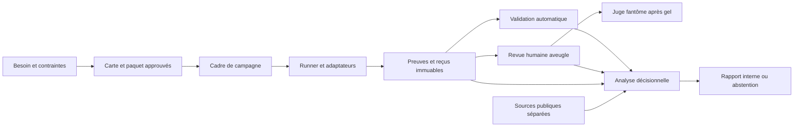

# Architecture de la V0 décisionnelle

Version documentaire du 14 août 2026

## 1. Rôle et autorité

Ce document décrit l’architecture logique choisie pour répondre à la question : « Sur le workflow exact de mon besoin, combien me coûte en pratique une sortie acceptable, et quelle configuration choisir ? »

Le [PRD](PRD.md) gouverne le produit et les décisions attendues. [RULES](RULES.md) porte les invariants universels. Le [gabarit de carte](../tasks/TEMPLATE.md) décrit le contrat d’un workflow mesuré.

Cette architecture est neutre vis-à-vis de l’outil. Un composant peut être manuel, fourni par une solution existante ou développé dans Lab-X. L’architecture ne justifie pas, à elle seule, une plateforme spécifique.

## 2. État des capacités

| Capacité | État | Portée prouvée |
|---|---|---|
| Paquet pré-cadrage | fait actuel | contrat de sortie compilé, en attente d’approbation externe, sans mesure comparative |
| Campagnes, reçus et prototypes antérieurs | fait actuel historique | preuves immuables de leurs contrats propres, non transférables à la V0 |
| Pilote décisionnel pré-cadrage | décision V0 | architecture et protocole documentaire choisis, campagne comparative non exécutée |
| Rapport interne de décision | décision V0 | sortie recommandée, pas encore produite à partir d’une campagne V0 |
| Import de benchmarks publics | décision de méthode | contexte séparé, provenance et limites obligatoires |
| Site ou sélecteur | prospectif conditionnel | seulement après une décision utile du pilote ou une abstention justifiée acceptée par le propriétaire, et sous la porte outil du PRD |
| Comparaison des abonnements | prospectif V1 | produit, plan, quotas et expérience comme identité |
| Auto-hébergement | prospectif V2 | coût complet, matériel, stack, exploitation et souveraineté comme identité |

Le dépôt contient une ancienne architecture centrée sur une campagne HTML et des cartes techniques. Elle est conservée dans l’[archive documentaire](archive/legacy-benchmark-v0-2026-08-14/README.md) et dans ses preuves historiques. Elle n’est pas l’architecture produit active.

## 3. Objets et identités

### 3.1 Carte de workflow

Une carte décrit un besoin exact et une décision réelle. Elle lie :

- le contexte d’usage et la décision à prendre
- le stimulus candidat-visible
- le contrat de sortie
- les contrôles automatiques entièrement décidables par code
- la rubrique humaine aveugle
- les témoins, la provenance et les limites
- la politique de données et les empreintes d’approbation

Une carte approuvée reste immuable. Toute modification qui change le stimulus, l’acceptabilité ou la conclusion permise crée une nouvelle version.

### 3.2 Paquet de carte et registre

Le paquet rassemble les fichiers nécessaires à l’exécution et à l’évaluation d’une carte. Le registre décrit leur rôle et leur version. Le manifeste machine-readable du paquet liste ses fichiers et leurs empreintes, sans hash autoréférentiel. Le paquet sépare `qualification_status` et `execution_status`.

Le paquet pré-cadrage actuel qualifie un contrat de sortie. Il ne contient pas encore les preuves d’une comparaison de configurations. Son approbation humaine n’est pas prouvée : elle sera externe et liée au SHA-256 de son manifeste ou de la PR qui le porte. Seule cette approbation humaine liée aux empreintes fera autorité. Une consolidation par plusieurs humains ou LLM ne remplace pas cette approbation.

### 3.3 Configuration fixe

Une configuration fixe comprend tous les éléments susceptibles d’influencer la sortie ou son coût :

- modèle et révision demandés
- fournisseur, route et endpoint lorsqu’ils sont fixés
- paramètres envoyés et limites applicables
- politique de données
- version de l’adaptateur et du harnais
- outils, environnement et intervention humaine lorsqu’ils font partie du workflow

La route, le fournisseur et les paramètres effectivement servis sont observés dans les reçus. Une divergence avec l’identité verrouillée rend la preuve officielle inutilisable pour cette configuration.

### 3.4 Politique de routage

OpenRouter Auto Router est une politique de routage distincte, jamais l’identité d’un modèle fixe. Son identité de campagne comprend au minimum la politique demandée, ses contraintes, les paramètres envoyés, la version de l’adaptateur et les observations retournées.

Le modèle, le fournisseur, la route et les paramètres servis sont des observations. La politique peut sélectionner des routes différentes entre des acquisitions. Cette variabilité fait partie de l’objet mesuré et doit rester visible.

### 3.5 Campagne et acquisition

Une campagne immuable lie :

- une version exacte de carte et de paquet
- le panel de configurations admissibles
- les conditions de comparabilité et de fraîcheur
- le plan d’acquisition justifié
- les prix et unités monétaires datés
- les règles de validation et d’analyse
- les autorisations et empreintes nécessaires

Une acquisition est une tentative prévue pour une configuration dans cette campagne. Son reçu sépare l’attendu de l’observé et conserve coûts, latence, provenance, statut fournisseur et empreintes utiles.

Aucun nombre d’acquisitions n’est imposé par l’architecture. Le plan est justifié par la décision visée et les preuves nécessaires.

### 3.6 Versions typées

Chaque campagne porte un `campaign_id` immuable et référence la valeur exacte de chaque dimension versionnée dont elle dépend. La matrice suivante est normative et minimale. Elle type les dimensions sans inventer de schéma logiciel ni de règle de compatibilité : une règle de compatibilité n’existe que lorsqu’elle est déclarée par l’objet concerné.

| Dimension | Objet typé | Valeur ou état courant |
|---|---|---|
| `product_version` | version produit cumulative | `V0` ; V1 et V2 prospectives |
| `measurement_profile` | profil de mesure parallèle : API, abonnement ou auto-hébergé | API, seul profil ouvert |
| `card_version` | version d’une carte de workflow et de son paquet | portée par le registre et le manifeste du paquet |
| `artifact_schema` | schéma de la sortie candidate ; le champ `version` de l’enveloppe YAML du pré-cadrage désigne cette dimension, pas la version produit | `V0` |
| `protocol_version` | protocole de mesure d’une campagne ; `benchmark-lab-x/protocol/v2` reste historique | à déclarer avant la première campagne |
| `receipt_schema` | schéma des reçus d’acquisition | à déclarer avant la première campagne |
| `decision_policy_version` | politique de décision appliquée à une campagne | à déclarer avant la première campagne |
| `view_schema` | schéma d’une vue ou d’un rapport régénérable | à déclarer avant la première vue |

## 4. Composants logiques

### 4.1 Registre et paquet de carte

Responsabilités :

- valider les chemins autorisés et les empreintes
- distinguer stimulus, actifs juge et témoins
- lier l’approbation humaine à la version exacte
- refuser toute donnée client réelle, tout secret et tout connecteur de production

### 4.2 Cadre de campagne

Il transforme la décision à éclairer en plan verrouillé. Il fixe le panel, la carte, les configurations, les sources de prix, les critères de fraîcheur, les préférences éventuelles et les règles de sortie.

Sans budget ni autre préférence explicite, il ne préconfigure aucun gagnant. Il demande une restitution de toutes les configurations compatibles et comparables, suivie du front de Pareto observé.

### 4.3 Runner et adaptateurs

Le runner orchestre les acquisitions sans porter la sémantique d’un fournisseur. Chaque adaptateur :

- sérialise la requête attendue
- observe la réponse et les métadonnées réellement disponibles
- classe séparément sortie candidate, panne fournisseur et défaut du harnais
- consigne route, fournisseur, paramètres, usage, coût et latence lorsque la source les fournit
- refuse d’inventer une observation absente

Une panne fournisseur pénalise la réussite bout en bout lorsque la route appartient à la configuration. `HARNESS_ERROR` ne pénalise pas la configuration, mais réduit la couverture et reste visible.

### 4.4 Canari de route

Avant toute configuration officielle OpenRouter, un canari distinct vérifie que l’adaptateur peut observer les éléments nécessaires. Pour une configuration fixe, il doit notamment rendre vérifiables route, fournisseur et paramètres servis.

Auto Router est diagnostiqué avant son admission officielle. Le canari ne prouve aucun bénéfice du routage et ne devient ni une acquisition comparative ni un score.

### 4.5 Registre de preuves

Le registre de preuves est append-only. Il conserve les liens entre :

- carte, paquet et approbation
- campagne et configuration attendue
- requête, réponse et métadonnées observées
- contrôle automatique et version de l’instrument
- présentation aveugle et verdict humain gelé
- analyse, sources de prix et rapport produit

Une vue peut évoluer. Un reçu ou une campagne historique ne change pas.

### 4.6 Validation automatique

Le validateur automatique traite seulement les propriétés entièrement décidables par code. Il produit `PASS`, `FAIL` ou un état technique explicite avec les preuves nécessaires.

Une propriété sémantique, esthétique ou utile à un humain n’est pas transformée en pseudo-test mécanique. Elle appartient à la revue humaine.

### 4.7 Revue humaine aveugle

Le poste de revue présente la sortie sans identité de configuration, coût ni métadonnée susceptible de dévoiler le candidat. La rubrique versionnée permet les verdicts `ACCEPTABLE`, `NOT_ACCEPTABLE` ou `UNABLE_TO_JUDGE`, avec justification liée à la sortie.

Le verdict officiel d’une sortie est obtenu seulement par la formule : `PASS automatique + ACCEPTABLE humain`.

Le juge LLM fantôme intervient après gel du verdict humain. Son avis est stocké séparément et ne modifie ni l’acceptabilité officielle ni la campagne.

### 4.8 Analyse décisionnelle

L’analyse calcule et présente :

- taux de sorties officiellement acceptables
- coût fournisseur par sortie officiellement acceptable, l’effort humain et les opérations restant consignés séparément sans conversion monétaire implicite
- latence
- couverture du harnais
- provenance et fraîcheur

Elle ne fusionne pas des scores publics incompatibles avec le pilote local. Elle peut joindre des signaux externes comme contexte séparé.

Avec une préférence explicite, elle recommande la configuration compatible qui répond à cette préférence. Sans préférence suffisante, elle affiche les configurations compatibles et comparables, le front de Pareto observé, puis s’abstient de désigner un gagnant unique.

### 4.9 Rapport interne

Le rapport interne est la sortie V0. Il montre les résultats, dénominateurs, coûts, pannes fournisseur, défauts de couverture, provenance, limites et motifs d’abstention. Il distingue clairement fait mesuré, interprétation et hypothèse.

Aucun site public n’est nécessaire pour produire cette décision.

### 4.10 Import externe futur

Un importateur futur peut enregistrer des benchmarks publics avec source primaire, date, protocole, population, fraîcheur et limites. Il ne crée pas de score global et ne rend pas comparables des mesures qui ne le sont pas.

GDPval et les méthodes comparables inspirent le réalisme des tâches et l’évaluation experte. Ils ne remplacent pas automatiquement le pilote sur le workflow exact.

## 5. Flux V0

1. Qualifier le besoin, le contrat de sortie et la décision visée.
2. Approuver les empreintes du paquet de carte.
3. Comparer Promptfoo, Ori Eval et une méthode manuelle à l’effort complet nécessaire.
4. Arrêter la plateforme spécifique si l’une de ces voies produit la même décision sans perte pertinente avec moins d’effort complet.
5. Diagnostiquer Auto Router et qualifier les canaris nécessaires.
6. Verrouiller carte, panel, configurations, prix, plan d’acquisition et préférences.
7. Exécuter les acquisitions et écrire les reçus immuables.
8. Appliquer les contrôles automatiques.
9. Geler les verdicts humains aveugles.
10. Calculer les mesures et produire le rapport ou l’abstention.
11. Exécuter éventuellement le juge fantôme, sans effet officiel.

La numérotation décrit l’ordre logique. Elle ne fixe ni délai, ni nombre de runs, ni nombre de relectures.

## 6. Frontières de sécurité

- aucune donnée client réelle, aucun secret et aucun connecteur de production dans une carte V0
- aucun actif juge envoyé au candidat
- aucune action externe autorisée par une sortie candidate
- secrets d’API fournis uniquement au transport autorisé, jamais aux artefacts durables
- permissions minimales et environnement isolé pour toute exécution outillée
- arrêt fail-closed lorsque l’identité, la provenance ou l’intégrité ne sont pas prouvées

## 7. Évolution

Les contrats et politiques sont versionnés. Les campagnes et reçus restent immuables. Les vues peuvent être régénérées en indiquant leur version et leurs sources.

Les versions produit sont cumulatives et les profils de mesure sont parallèles. V1 ajoute le profil abonnement : l’identité inclut produit, plan, quotas, resets, interface, harnais et intervention humaine. V2 ajoute le profil auto-hébergé : l’identité inclut modèle, checkpoint, quantification, matériel, stack, énergie, amortissement, administration, occupation GPU, confidentialité et souveraineté. Coût marginal et coût complet restent séparés. Chaque profil est qualifié indépendamment. Aucune comparaison inter-profils n’est permise sans contrat commun explicite.

La souveraineté est une dimension d’identité distincte de la confidentialité : un déploiement confidentiel peut rester dépendant d’un fournisseur, d’une juridiction ou d’une chaîne matérielle non souveraine. Ses critères détaillés ne sont pas définis ici. Une spécification propriétaire et une preuve associée sont requises avant l’ouverture du profil auto-hébergé.

Le site ou sélecteur reste conditionnel. Il devient envisageable seulement après une décision utile du pilote ou une abstention justifiée acceptée par le propriétaire, et sous la porte outil du PRD. Il reçoit besoin, contraintes et budget facultatif, puis recommande ou s’abstient avec provenance.
