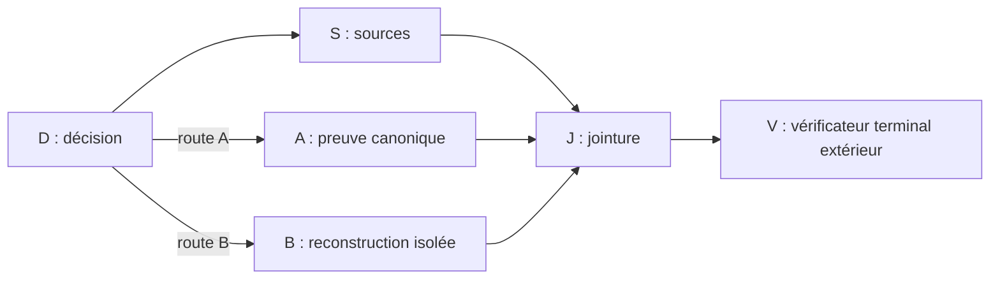

# Loop et Graph Engineering appliqués aux boucles agentiques d’Ayo

## Portée et niveaux de preuve

Ce rapport clôt l’apprentissage, l’audit et le premier pilote local dans Benchmark Lab‑X. Il ne vaut ni autorisation de généralisation, ni mutation globale, ni adoption de plateforme.

`[DÉCISION D’AYO]` KISS s’applique à l’ensemble du travail : produit, architecture, code, outils, méthodes, workflows, contrôles et documentation. La [page canonique](graph-engineering-canonical-wiki.md#principe-kiss-global) porte cette règle. Le rapport conserve les preuves du pilote sans créer une seconde doctrine.

Les affirmations importantes portent l’un des marqueurs suivants :

- `[TEXTE INTÉGRAL]` : lecture complète d’un papier, d’une documentation active, d’un fichier source ou d’un artefact d’exécution ;
- `[TITRE/RÉSUMÉ]` : repérage limité aux métadonnées, au titre ou au résumé ;
- `[DÉDUCTION]` : synthèse tirée de plusieurs sources ou observations ;
- `[HYPOTHÈSE NON VÉRIFIÉE]` : proposition qui demande une expérience supplémentaire ;
- `[DÉCISION D’AYO]` : périmètre ou choix donné directement par Ayo.

## 1. Corpus étudié et qualité

### Corpus fourni par Ayo

| Source | Nature retenue | Apport et limite |
|---|---|---|
| [AGORA, arXiv:2505.24354](https://arxiv.org/abs/2505.24354) | Papier primaire, texte intégral | `[TEXTE INTÉGRAL]` Moteur d’orchestration en DAG, branches, boucles et évaluation comparative. Les expériences montrent aussi que des méthodes simples peuvent être plus exactes ou moins coûteuses. Le papier ne traite pas la reprise exacte, les écritures concurrentes, l’intervention humaine ou les fausses fins. |
| [Loop Engineering: Building Blocks, Adoption, and Impact, arXiv:2608.21884v2](https://arxiv.org/abs/2608.21884) | Prépublication scientifique, texte intégral | `[TEXTE INTÉGRAL]` Première étude empirique retrouvée qui formalise le terme, ses couches et ses risques. Sur 36 710 dépôts initiaux, 36 645 ont été scannés après 65 disparitions ; 217 boucles ont été confirmées. Le papier ne démontre aucun gain causal de qualité ou de productivité et reste annoncé *under review*. |
| [beamnxw](https://x.com/beamnxw/status/2081670690223030343) | Retour de terrain | `[TEXTE INTÉGRAL]` Définitions et couches d’orchestration utiles. Ce contenu ne fournit pas de protocole expérimental. |
| [akshay_pachaar](https://x.com/akshay_pachaar/status/2081089131808243999) | Retour de terrain | `[TEXTE INTÉGRAL]` Contrats de nœuds, checkpoints, rejeu idempotent et propriétaire d’écriture. Les garanties restent affirmées, pas démontrées. |
| [EXM7777](https://x.com/EXM7777/status/2079934660982047021) | Terrain et contenu commercial | `[TEXTE INTÉGRAL]` Structure en losange, condition d’arrêt, porte humaine et budgets. L’intérêt commercial réduit le poids probant. |
| [polydao](https://x.com/polydao/status/2092187828234993708) | Opinion de terrain, hors vocabulaire retenu | `[TEXTE INTÉGRAL]` Le contenu porte surtout sur l’organisation des connaissances et du contexte. Il n’est pas utilisé comme autorité sur les structures d’exécution agentique. |
| [0xWast3](https://x.com/0xWast3/status/2079899723947712845) | Retour de terrain et opinion | `[TEXTE INTÉGRAL]` Fausses dépendances, effondrement du contexte, ressources partagées et échecs silencieux. Aucune fréquence ni causalité contrôlée n’est fournie. |
| [AnatoliKopadze](https://x.com/AnatoliKopadze/status/2080668775796314331) | Terrain et contenu commercial | `[TEXTE INTÉGRAL]` Structure en losange et discipline de vérification. Les gains de coût et les réécritures annoncées restent non vérifiés. |

`[DÉDUCTION]` Les six publications X servent de catalogue de risques et de scénarios d’échec. Elles ne comptent pas comme six confirmations scientifiques indépendantes.

### Repérage `/neuroarxiv`

`[TEXTE INTÉGRAL]` Une session Claude Code propre a invoqué explicitement `/neuroarxiv`. Identité : session `9c09a92d-6dbd-4a75-a4e7-2f189c8d5a60`, Claude Code `2.1.251`. Les 53 messages assistant de la trace du coordinateur portent `claude-fable-5`. Aucun fallback n’a été utilisé. Les lecteurs internes ont utilisé principalement Sonnet 5 et, pour une petite part, Haiku 4.5. Il s’agit d’une vérification par la trace locale et le sélecteur observé, sans attestation indépendante du fournisseur.

`[TITRE/RÉSUMÉ]` Le repérage a lu 29 titres et résumés, avec 29 sous-tâches terminées et zéro échec. Sa durée observée est d’environ 14 min 52 s. Le coût rapporté par Claude est de 8,0929 USD : 6,4613 USD pour Fable, 1,5025 USD pour Sonnet et 0,1291 USD pour Haiku. Cette sortie a servi uniquement à choisir les PDF.

### Papiers lus intégralement après repérage

| Papier | Qualité utile | Limite principale |
|---|---|---|
| [AGORA](https://arxiv.org/abs/2505.24354) | `[TEXTE INTÉGRAL]` Système primaire avec code et évaluations ; accepté comme démonstration ACL 2025. | Reproductibilité partielle et absence de reprise durable exacte. |
| [Flow](https://arxiv.org/abs/2501.07834) | `[TEXTE INTÉGRAL]` Représentation AOV, dépendances et parallélisme. | Pas d’état durable, d’idempotence ou de sémantique complète de jointure. |
| [Sherlock](https://arxiv.org/abs/2511.00330) | `[TEXTE INTÉGRAL]` Vérification sélective et retour au dernier état vérifié. | La vérification peut atteindre 28,9 fois la latence et 53,2 fois le coût selon les cas étudiés ; les effets irréversibles restent hors garantie. |
| [AEVAL](https://arxiv.org/abs/2607.16345) | `[TEXTE INTÉGRAL]` Séparation exécuteur/évaluateur, assertions préparées avant la sortie et notation de la première tentative. | Preuve quantitative limitée et contrat fourni par le développeur. |
| [Agent Mesh](https://arxiv.org/abs/2608.26225) | `[TEXTE INTÉGRAL]` Étude de 147 incidents sur 81 runs ; identité et preuve de progression comme causes récurrentes. | Une plateforme observée et primitives proposées non évaluées par une expérience contrôlée. |
| [PatchOptic](https://arxiv.org/abs/2607.05483) | `[TEXTE INTÉGRAL]` Vue de lecture, région d’écriture, source du patch et vérification avant commit. | Les hypothèses excluent branches, reprises, rollback et effets externes. |
| [IAL‑Scan](https://arxiv.org/abs/2607.01641) | `[TEXTE INTÉGRAL]` Boucles bornées sur le vrai chemin de contrôle ; 6 549 dépôts examinés. | Faux positifs, faux négatifs et filtre par modèle instable. |
| [Architectures for Building Agentic AI](https://arxiv.org/abs/2512.09458) | `[TEXTE INTÉGRAL]` Chapitre de synthèse sur contrats typés, permissions, idempotence, budgets, vérification et observabilité. | Source secondaire, sans évaluation propre suffisante pour décider une architecture. |
| [AnalysisBench](https://arxiv.org/abs/2604.11270) | `[TEXTE INTÉGRAL]` Les succès auto-déclarés surestiment les succès vérifiés ; les fausses fins sont reliées aux signaux superficiels et aux pipelines partiels. | 35 tâches non indépendantes, trois répétitions, un validateur manuel principal et un juge heuristique. |
| [Agent libOS](https://arxiv.org/abs/2606.03895) | `[TEXTE INTÉGRAL]` Intention durable avant envoi, état ambigu après effet et interdiction du rejeu aveugle. | Prototype monoauteur, scénarios synthétiques et une configuration modèle/fournisseur pour les trajectoires live. |

`[DÉDUCTION]` La présence sur arXiv augmente l’accessibilité et la vérifiabilité du texte. Elle ne prouve ni revue par les pairs, ni exactitude, ni reproductibilité. Le poids retenu dépend du protocole, des artefacts, des limites déclarées et de la possibilité de reproduire les résultats.

### Formalisation récente et vidéo fournie

`[TEXTE INTÉGRAL]` [Addy Osmani](https://addyo.substack.com/p/loop-engineering) a publié en juin 2026 une définition praticienne explicite du Loop Engineering. Il place la boucle au-dessus du *harness* d’une exécution unique et insiste sur le déclenchement, la vérification, l’état extérieur à la conversation et les limites de coût. La priorité mondiale du terme n’a pas été établie.

`[TEXTE INTÉGRAL]` La vidéo [« J’ai automatisé mon travail avec ChatGPT : voici le résultat ! »](https://www.youtube.com/watch?v=J9J-EHePEP0), publiée le 28 août 2026 par IA Talkshow, a été étudiée sur sa transcription automatique française complète. Elle décrit l’état durable, les checkpoints, les postconditions, les erreurs et une intervention humaine après échec. Elle ne fournit ni code, ni journal brut, ni coût, ni test de reprise. La promotion de formations et plusieurs affirmations non sourcées en font un retour terrain commercial, pas une preuve scientifique.

`[TEXTE INTÉGRAL]` Une vidéo connexe de la même chaîne, [« ChatGPT 5.6 WORK JARVIS »](https://www.youtube.com/watch?v=1-A_vU9Wheo), reconnaît le biais d’auto-évaluation et recommande un évaluateur distinct. L’affirmation d’une exécution de 17 heures reste un témoignage sans trace reproductible.

`[DÉDUCTION]` Les idées utiles de ces vidéos sont conservées quand elles concordent avec les papiers ou le pilote : état durable, postcondition, terminal borné et escalade sur ambiguïté. Les seuils universels de lignes ou de tentatives, la suppression automatique d’un effet non conforme et les promesses de fiabilité multi-agent sont rejetés faute de preuve.

### Second avis

`[TEXTE INTÉGRAL]` Oracle a été consulté une seule fois dans la session `handoff-consult-878e4af8`. Le modèle demandé et observé était GPT‑5.6 Sol. Son verdict était `GO_PILOTE_LOCAL` et `HOLD` pour une plateforme générique ou une généralisation. Il a recommandé cinq nœuds déclarés, un vérificateur terminal extérieur et trois scénarios. Le pilote suit ce périmètre.

### Consolidation Oracle complémentaire

`[TEXTE INTÉGRAL]` Trois tranches ultérieures ont chacune trouvé Oracle `LOCAL_READY`, puis ont été refusées avant soumission avec `oracle_busy` : `handoff-consult-5ff0689f`, `handoff-consult-d094ca01`, puis `handoff-consult-b54f7315` après le GO explicite du 31 août. Lors de la troisième tentative, une session distincte `handoff-consult-be39cb12` détenait le verrou et apparaissait `running`. Aucune session rattachable n’existe sous les trois identifiants refusés. Chaque tranche s’est arrêtée sans relance, suppression du verrou ou contournement. Aucun avis n’est attribué à Oracle sur ces consolidations : `HOLD`.

### Tentative de consolidation par ChatGPT Work

`[TEXTE INTÉGRAL]` Ayo a autorisé une conversation neuve hors projet, le mode visible `Pro`, quatre copies staging et un envoi unique. La transaction `59445f13-1786-4912-a8bf-cd362c1f3eaf` a vérifié un chat vide, le mode visible et les quatre empreintes avant l’unique upload. Le compositeur a d’abord affiché les quatre fichiers, puis s’est stabilisé avec les seuls fichiers 02 à 04. Le contrat 01 avait disparu. Le contrôleur s’est arrêté en `HOLD_COMPOSER_ATTACHMENTS` avant toute saisie ou soumission du prompt, sans relance ni second chat.

`[DÉDUCTION]` Aucun avis ne peut être attribué à ChatGPT Work sur cette tentative. Le libellé `Pro` prouve uniquement la sélection visible dans l’interface, pas l’identité du modèle exécuté. Cette tentative reste `HOLD` et ne contribue pas au verdict.

### Consolidation Oracle finale

`[TEXTE INTÉGRAL]` La session `handoff-consult-ece42263` a terminé l’unique consultation post-revue avec les quatre fichiers. Oracle a confirmé séparément la réflexion `Pro` déjà sélectionnée et le modèle demandé, ciblé puis résolu `GPT-5.6 Sol`, avec `verified=yes` dans la preuve du sélecteur. La session a duré 8 min 10 s et rapporté environ 24,71 k tokens en entrée et 1,87 k en sortie. Aucun coût n’était affiché. Le rendu local porte le SHA‑256 `f47195894abb7127174e0c2e884958f8dd77eaac647a91cf4c9e04f151c2bd27`. État : `LIVE_VERIFIED` pour cette session uniquement.

`[TEXTE INTÉGRAL]` Oracle rend `CORRIGER_LE_PILOTE`. Il confirme le terminal extérieur, la reprise testée et le refus des 13 fausses fins. Il refuse la généralisation tant que les reçus peuvent annoncer `evaluated/PASS` avant évaluation et rester partiels après interruption. `PASS_PILOTE_LOCAL` peut rester sans renommage comme verdict terminal réduit, jamais comme acceptation globale du pilote.

`[TEXTE INTÉGRAL]` Oracle confirme l’architecture `run`/`verify` et l’absence de besoin pour un moteur, un DSL, un scheduler, une base de données, Herdr, Paperclip local ou le multi-écrivain. Il corrige l’ordre des trois travaux : évaluer avant fermeture, publier atomiquement avec une règle pour les artefacts `B/u025` non engagés, puis rendre la racine du test injectable.

## 2. Définition opérationnelle

`[DÉDUCTION]` Le **Graph Engineering** est la discipline qui conçoit, contraint, instrumente et vérifie une structure d’exécution agentique explicite. Il rend observables les nœuds, leurs dépendances, les transitions conditionnelles, les bifurcations, les jointures, les évaluateurs et les reprises. Une exécution devient verte seulement quand un vérificateur distinct confirme l’ensemble exact des nœuds sélectionnés et leurs preuves.

`[DÉDUCTION]` Le **Loop Engineering** concerne un cycle de progression borné, dans un nœud ou entre plusieurs nœuds : signal de progrès capable de changer, évaluateur, gestion du contexte, budget, règle de nouvelle tentative, état ambigu, intervention humaine et condition d’arrêt. Une boucle ne constitue pas à elle seule une structure d’exécution complète.

`[TEXTE INTÉGRAL]` « Loop Engineering » est une formalisation praticienne récente, nommée publiquement en juin 2026 puis étudiée dans la prépublication arXiv:2608.21884v2. Les mécanismes assemblés sous ce nom sont plus anciens. Le terme possède donc une définition de travail, sans être encore une discipline scientifique stabilisée ni une preuve d’efficacité.

`[TEXTE INTÉGRAL]` Le papier de Loop Engineering situe le « Graph Engineering » dans sa discussion prospective de juillet 2026 : les agents sont des nœuds ; le travail, l’état et les décisions de routage circulent le long des arêtes. Cette mention ne valide ni une méthode complète ni ses bénéfices. La définition opérationnelle du présent rapport reste une déduction testée par le pilote.

### Glossaire

- **AOV, Activity-on-Vertex** : représentation en graphe orienté acyclique où chaque sommet porte une activité et chaque arête une relation de précédence. Dans [Flow](https://arxiv.org/abs/2501.07834), les sommets sont des sous-tâches agentiques et les arêtes leurs dépendances. AOV décrit la représentation des travaux dépendants, pas la reprise durable ni l’exécution complète.
- **Évaluateur** : contrôle qui décide si la sortie d’un nœud satisfait son contrat de réussite.
- **Guardrail** : validation automatique proche d’une entrée, d’une sortie ou d’un appel d’outil. Un guardrail peut renvoyer une erreur récupérable ; il ne demande pas nécessairement une intervention humaine.
- **Gate humain** : pause réservée à une autorité manquante, un effet externe sensible ou une ambiguïté que l’automatisation ne peut pas trancher sans risque.
- **Jointure** : nœud qui attend et vérifie l’ensemble exact des prédécesseurs sélectionnés avant de continuer.
- **Reçu durable** : état fermé d’un nœud avec identité, entrées, sortie ou erreur, tentative, propriétaire, preuve d’évaluation et prochaine action autorisée.

`[HYPOTHÈSE NON VÉRIFIÉE]` Cette définition peut devenir un contrat commun à plusieurs projets d’Ayo. Un pilote local ne suffit pas à établir sa transférabilité.

## 3. Approches et limites

| Approche | Apport établi | Limite pour Ayo |
|---|---|---|
| DAG ou AOV | `[TEXTE INTÉGRAL]` Rend dépendances, disponibilité et parallélisme explicites. | La représentation seule ne prévient ni fausse fin ni effet ambigu. |
| Évaluateur séparé | `[TEXTE INTÉGRAL]` Réduit l’auto-validation et rend le contrat testable. | La qualité dépend de l’oracle et de la preuve disponible. |
| Vérification sélective | `[TEXTE INTÉGRAL]` Place le coût sur les nœuds qui propagent le plus d’erreurs. | Le placement et le retour deviennent coûteux ; aucun besoin de ce mécanisme au premier pilote. |
| Reçus et état durable | `[TEXTE INTÉGRAL]` Permet une reprise depuis une frontière fermée et attribuable. | Ne restaure ni mémoire cachée du modèle, ni processus, ni effet externe incertain. |
| Région d’écriture | `[TEXTE INTÉGRAL]` Rend le propriétaire et les conflits vérifiables. | Éviter un conflit par mono-écrivain ne démontre pas la sûreté multi-écrivains. |
| Intention avant effet | `[TEXTE INTÉGRAL]` Évite le rejeu aveugle quand l’effet est ambigu. | Aucune garantie générale d’exécution exactement une fois. |
| Borne de boucle | `[TEXTE INTÉGRAL]` Lie la limite au chemin de contrôle qui atteint coût, outil ou état croissant. | Une limite de messages peut manquer le vrai cycle. |
| Moteur durable existant | `[TEXTE INTÉGRAL]` LangGraph, Temporal et Prefect proposent checkpoints, branches, reprises ou transactions selon leur modèle. | Le contrat terminal et la sémantique des effets restent applicatifs. Une nouvelle plateforme n’est pas nécessaire au pilote. |

`[TEXTE INTÉGRAL]` Les documentations actives consultées confirment les limites suivantes : LangGraph reprend un nœud depuis son début après une interruption ; Temporal exige des activités idempotentes lorsque l’effet peut précéder la perte d’accusé ; Prefect documente qu’un flow peut finir `COMPLETED` malgré l’échec capturé d’une tâche enfant. Sources : [LangGraph Persistence](https://docs.langchain.com/oss/python/langgraph/persistence), [LangGraph Interrupts](https://docs.langchain.com/oss/python/langgraph/interrupts), [Temporal Event History](https://docs.temporal.io/encyclopedia/event-history), [Temporal Activity Execution](https://docs.temporal.io/activity-execution), [Prefect States](https://docs.prefect.io/v3/concepts/states).

`[DÉDUCTION]` Aucun papier ni runtime étudié ne couvre seul l’ensemble du besoin. Le premier pilote doit assembler des primitives natives et locales.

## 4. Audit de l’environnement actuel

| Capacité | Fait observé | Limite par rapport à la cible |
|---|---|---|
| Codex | `[TEXTE INTÉGRAL]` `codex-cli 0.151.0` expose `goals`, `hooks` et `multi_agent` comme fonctions stables. `/goal` porte un objectif durable, ses critères de fin, sa durée, ses tokens, puis permet consultation, édition, pause, reprise et effacement. | La relation parent/enfant reste une hiérarchie de coordination, sans multi-parent, condition, jointure ou évaluateur par nœud. Une reprise restaure la tâche et son intention, pas la frontière exacte d’un effet externe. |
| Codex `/goal` | `[TEXTE INTÉGRAL]` La documentation active prévoit explicitement des travaux de plusieurs heures. Le goal ne change ni les permissions ni le sandbox. | Primitive native de Loop Engineering, pas graphe d’exécution. La confiance terminale du goal ne remplace pas le vérificateur qui lit les reçus des nœuds. |
| Claude Code | `[TEXTE INTÉGRAL]` Version `2.1.251`. `/goal` relance un tour après le verdict d’un petit modèle distinct ; `/loop` relance un prompt selon le temps. | L’évaluateur de `/goal` ne voit que le transcript. À la reprise, sa condition revient mais ses compteurs et sa base de coût repartent de zéro. `/loop` expire après sept jours, ne rattrape pas les déclenchements manqués et ne restaure pas les processus de fond. |
| Herdr | `[TEXTE INTÉGRAL]` Version `0.8.0`, protocole 19, serveur non actif et `HERDR_ENV` absent pendant l’audit. | Aucun manque du pilote ne requiert Herdr. Décision KISS : ne pas l’introduire tant qu’une défaillance observée ne réclame pas sa capacité propre. |
| Paperclip | `[TEXTE INTÉGRAL]` Un ancien dépôt local existe, sans service actif. `[DÉCISION D’AYO]` L’instance courante se trouve sur `perso-hermes` et Paperclip n’appartient pas au périmètre du MacBook. | Ne pas utiliser le dépôt local pour le Graph Engineering. Paperclip n’est requis ni par le pilote ni par le modèle minimal. |
| Skills et hooks | `[TEXTE INTÉGRAL]` Les skills définissent des procédures ; les hooks gardent les frontières d’outils et de sessions. | Ils ne persistent ni état de nœud, ni transition, ni vérité terminale. |
| État durable | `[TEXTE INTÉGRAL]` Codex et Claude conservent transcripts, identités et métriques. Benchmark Lab‑X possède des preuves append-only U‑025 V3. | Les inventaires Codex présentent quelques lignes absentes, périmées ou dupliquées. Aucun schéma commun de reçu n’existe. |
| Observabilité | `[TEXTE INTÉGRAL]` Logs, durées, erreurs et tokens existent dans les runtimes. | La corrélation temps, coût, humain et artefact par nœud manque. |

`[TEXTE INTÉGRAL]` L’audit du dépôt Benchmark Lab‑X a été effectué au HEAD local `81c217e0a585e89c0151090d6cef9581b8a2c741`, avec `main` propre. Les tests U‑025 V2/V3 existants ont rendu 7/7. Le vérificateur V3 publié a rendu `PASS`, racine `1aa9d67b15244c547014b2b5c1062dd451369c61d43a33b8877b5e4eacbd8021`.

`[DÉDUCTION]` Les primitives suffisantes étaient déjà présentes : `/goal` pour la poursuite longue, worktree Git, mono-écrivain, processus distincts, Python standard, reçus JSON canoniques, SHA‑256, U‑025 V3 et vérificateur séparé. Herdr, Paperclip local et un moteur externe ne sont pas nécessaires.

## 5. Écart entre l’existant et la cible

| Déjà disponible | Écart comblé par le pilote | Reste ouvert |
|---|---|---|
| `[TEXTE INTÉGRAL]` Worktrees et sessions isolés. | `[TEXTE INTÉGRAL]` Base Git, genèse et propriétaire inscrits dans chaque run. | `[DÉDUCTION]` Corrélation native uniforme entre goal, session, processus et artefact. |
| `[TEXTE INTÉGRAL]` Preuves U‑025 adressées par contenu. | `[TEXTE INTÉGRAL]` Reçu commun pour chaque nœud et tentative. | `[DÉDUCTION]` Schéma partagé hors Benchmark Lab‑X. |
| `[TEXTE INTÉGRAL]` Reprise coopérative U‑025. | `[TEXTE INTÉGRAL]` Arrêt après `S` et interruption contrôlée pendant la fermeture de `B`, puis reprise sur `B` sans rejeu du préfixe. | `[HYPOTHÈSE NON VÉRIFIÉE]` Reprise après arrêt brutal du processus ou panne électrique. |
| `[TEXTE INTÉGRAL]` Contrôles automatiques décidables. | `[TEXTE INTÉGRAL]` Évaluateur local avant fermeture, contre-vérification terminale, jointure exacte et terminal extérieur. | `[DÉDUCTION]` Évaluation fiable d’une sortie agentique non déterministe sans oracle automatique. |
| `[TEXTE INTÉGRAL]` Mono-écrivain possible par worktree. | `[TEXTE INTÉGRAL]` Périmètre d’écriture déclaré et temporaires confinés. | `[HYPOTHÈSE NON VÉRIFIÉE]` Écritures réellement concurrentes et résolution de conflits. |

## 6. Modèle minimal retenu

`[DÉDUCTION]` Chaque nœud doit déclarer les champs suivants. Aucun champ supplémentaire n’est requis pour le premier pilote.

| Champ | Contrat minimal |
|---|---|
| Identité | `pilot_id`, `run_id`, `node_id`, tentative, base Git |
| Entrée | Genèse et empreintes des reçus parents |
| Sortie | Objet canonique et empreinte SHA‑256 |
| État | `pending`, `running`, `waiting`, `evaluated`, `failed`, `abstained` ou `ambiguous` |
| Déclenchement | Parents attendus et condition sélectionnée |
| Écriture | Propriétaire et chemins autorisés |
| Réussite | Contrat automatique décidable |
| Évaluateur | Identité du contrat, empreinte et verdict |
| Transition | Arêtes consommées et route choisie |
| Échec ou abstention | Propagation explicite vers `HOLD`, jamais conversion implicite en succès |
| Reprise | Chargement du dernier reçu fermé, validation de son empreinte et premier nœud non exécuté |
| Provenance | Sources, parents et chaîne d’empreintes |
| Mesures | Temps mural, CPU, coût externe, humain, processus et octets |
| Terminal | Vérificateur extérieur qui refuse tout nœud sélectionné absent, supplémentaire, non évalué, incohérent ou ambigu |

`[DÉDUCTION]` `evaluated` signifie que la réussite a été admise par l’évaluateur. L’état `ambiguous` interdit le rejeu automatique. Une jointure compare l’ensemble exact des prédécesseurs sélectionnés. Une condition terminale reste rouge tant qu’une transition sélectionnée n’est pas consommée.

### Gestion d’erreurs

`[DÉDUCTION]` Une boucle longue doit prévoir les erreurs sans convertir chaque incident en blocage humain. Le plus petit routage utile est le suivant :

| Classe observée | Action automatique | Quand arrêter ou demander Ayo |
|---|---|---|
| Service indisponible, rate limit, réseau | `waiting`, reprise bornée avec délai croissant | Budget ou délai global épuisé |
| Sortie invalide, test rouge, preuve absente | Retour au même nœud avec le diagnostic | Absence de progrès après la limite prévue |
| Dépendance encore active | `waiting`, sans verdict d’échec | Dépendance définitivement impossible |
| Conflit d’écriture | Abandonner la tentative, relire l’état, réessayer seulement si l’opération est sûre | Propriété ou nouvelle valeur impossible à déterminer |
| Timeout après effet externe | `ambiguous`, aucun rejeu aveugle | Toujours, tant qu’un reçu fiable ne tranche pas |
| Authentification, autorité, budget ou contexte irrécupérable | `failed` ou `abstained` | Quand une nouvelle autorité ou décision est nécessaire |

`[DÉDUCTION]` Une reprise relit le dernier reçu fermé et recommence au premier nœud incomplet. Elle ne déduit pas la prochaine action du seul transcript. La condition terminale exige que tous les nœuds requis et toutes les jointures soient résolus, sans état `pending`, `running`, `waiting` ou `ambiguous`.

### Guardrails et gates

`[TEXTE INTÉGRAL]` La documentation OpenAI sur les [guardrails et la revue humaine](https://developers.openai.com/api/docs/guides/agents/guardrails-approvals) distingue la validation automatique d’une pause avant action sensible. Elle recommande de placer le contrôle près de l’effet concerné.

`[DÉDUCTION]` Politique retenue : un guardrail déterministe renvoie une erreur exploitable et laisse la boucle corriger. Une gate humaine n’est ajoutée que pour une autorité manquante, une action externe sensible, une ambiguïté persistante ou un budget épuisé. Un test rouge ordinaire, un rate limit ou une sortie à corriger ne justifie pas un HOLD global.

### Durée des boucles

`[TEXTE INTÉGRAL]` Codex documente `/goal` pour des travaux de plusieurs heures. Claude Code restaure un goal actif et conserve les erreurs transitoires, tandis que `/loop` reste lié à une session, expire après sept jours et ne restaure pas ses processus de fond.

`[DÉDUCTION]` Une boucle de plus de 24 heures est donc plausible, mais sa durée doit provenir d’une suite d’unités courtes et reprenables. Les reçus durables, l’idempotence des effets, l’état `waiting`, le délai de nouvelle tentative, le coût cumulé et le terminal calculé depuis l’état durable comptent davantage qu’une conversation maintenue ouverte. Un essai de plus de 24 heures reste à mener sur la veille du Mac, l’expiration de session, les quotas et un redémarrage réel.

## 7. Structure d’exécution du pilote Benchmark Lab‑X



`[TEXTE INTÉGRAL]` Cinq nœuds sont déclarés. `V` est extérieur et ne produit aucun reçu de travail.

| Nœud | Dépendance et sortie | Écriture et évaluateur |
|---|---|---|
| `D` | Genèse vers exactement une route `A` ou `B`. | Son reçu ; recalcul de la route et de l’ensemble sélectionné. |
| `S` | Dépend de `D` ; empreintes des sources U‑025 V3 verrouillées. | Son reçu ; vérification des sources. |
| `A` | Dépend de `D` en route A ; racine U‑025 canonique. | Son reçu ; vérification U‑025 en mode verrouillé sans écriture. |
| `B` | Dépend de `D` en route B ; reconstruction U‑025 isolée. | Son reçu et `nodes/B/u025/` ; reproduction dynamique, vérification et comparaison. |
| `J` | Dépend de `S` et de la branche sélectionnée. | Son reçu ; exactement deux parents distincts et quatre arêtes consommées. |

`[TEXTE INTÉGRAL]` Les trois scénarios sont : route A nominale ; route B avec arrêt après `S`, verdict intermédiaire `HOLD` et reprise sur `B` ; matrice de 13 fausses fins. Une injection ciblée interrompt aussi la fermeture du reçu `B`. Le runner ne peut annoncer que l’arrêt contrôlé ou `EXECUTION_COMPLETE_PENDING_TERMINAL_VERIFICATION`. Seul `V` produit `PASS_PILOTE_LOCAL` ou `HOLD_PILOTE_LOCAL`.

### Mise en place concrète

Le pilote V1 est déjà développé sous forme de harnais local. Le graphe est codé en dur dans `tools/graph_engineering_pilot_v1.py`, et `tests/test_graph_engineering_pilot_v1.py` exécute les trois scénarios puis produit les mesures.

| Élément | Implémentation réelle |
|---|---|
| Graphe | `NODES`, `ROUTES`, `EDGES` et `CONTRACTS` déclarent les cinq nœuds et les deux routes. |
| Exécution | `run` écrit la genèse, puis les reçus immuables des nœuds sélectionnés. |
| Bifurcation | `D` sélectionne `A` ou `B` depuis la route admise par la genèse. Une seule branche peut exister. |
| Jointure | `J` exige les reçus de `S` et de la branche sélectionnée, avec quatre arêtes consommées au total. |
| Évaluation | Chaque sortie passe son évaluateur local avant la construction et la publication du reçu `evaluated/PASS`. `verify` exécute ensuite la contre-vérification complète. |
| Interruption | `--stop-after-s` ferme `D/S`. L’injection `interrupt-before-b-receipt` arrête la publication après synchronisation du temporaire de `B`. |
| Reprise | `--resume` relit et valide `D/S`, refuse un périmètre lié symboliquement, supprime l’état `B` non engagé et recommence sur `B`. |
| Terminal `V` | `verify`, en lecture seule, rend seul `PASS_PILOTE_LOCAL` ou `HOLD_PILOTE_LOCAL`. |

Une exécution manuelle doit utiliser un répertoire neuf. Les preuves sous `runs/graph-engineering-pilot-v1/` sont figées et ne doivent pas être écrasées.

```bash
cd /Users/ayo/Projects/benchmark-lab-x/runs/worktrees/graph-engineering-pilot-v1-worktree
PILOT_RUN_ROOT="$(mktemp -d /tmp/graph-pilot-v1.XXXXXX)"

python3 -m tools.graph_engineering_pilot_v1 run --run-dir "$PILOT_RUN_ROOT/S1" --scenario S1 --route A
python3 -m tools.graph_engineering_pilot_v1 verify --run-dir "$PILOT_RUN_ROOT/S1"

python3 -m tools.graph_engineering_pilot_v1 run --run-dir "$PILOT_RUN_ROOT/S2" --scenario S2 --route B --stop-after-s
python3 -m tools.graph_engineering_pilot_v1 verify --run-dir "$PILOT_RUN_ROOT/S2"
# Le code de sortie 1 et HOLD_PILOTE_LOCAL sont attendus ici

python3 -m tools.graph_engineering_pilot_v1 run --run-dir "$PILOT_RUN_ROOT/S2" --scenario S2 --route B --resume
python3 -m tools.graph_engineering_pilot_v1 verify --run-dir "$PILOT_RUN_ROOT/S2"
```

`[TEXTE INTÉGRAL]` Cette séquence a été rejouée dans un répertoire temporaire : S1 a rendu `PASS`, S2 interrompu a rendu le `HOLD` attendu, puis la reprise a commencé sur `B` sans rejeu et le terminal a rendu `PASS`.

`[TEXTE INTÉGRAL]` Les trois corrections Oracle sont appliquées et testées : évaluation avant fermeture ; publication exclusive depuis un temporaire synchronisé, suivie de la synchronisation du répertoire ; racine d’exécution injectable. Une sortie `J` fausse mais sérialisable ne produit aucun reçu final. Une interruption contrôlée pendant la fermeture de `B` laisse `D/S` inchangés, puis la reprise reconstruit `B` depuis sa frontière non engagée.

### Corrections Oracle V1

1. **Évaluation avant fermeture : PASS.** Le verdict local vient de l’évaluateur du nœud avant construction et publication du reçu.
2. **Publication et reprise : PASS.** Le reçu est publié sans remplacement par lien dur après `fsync` du temporaire, puis le répertoire est synchronisé. La reprise refuse les liens symboliques sur son périmètre et reconstruit `B` lorsqu’aucun reçu fermé n’existe.
3. **Racine injectable : PASS.** Deux suites complètes peuvent utiliser deux racines neuves sans copier le dépôt ni toucher aux preuves figées.

`[DÉDUCTION]` L’interface `run`/`verify` suffit. `run` peut relire l’état durable et poursuivre depuis le premier nœud incomplet ; ajouter une commande `step`, un moteur générique ou un registre de classes n’est pas justifié. Quand `B` deviendra réellement agentique, le même runner devra ajouter un délai et un groupe de processus, puis distinguer `waiting`, `failed` et `ambiguous` selon l’erreur observée.

Le premier candidat reste une seule fixture Benchmark Lab‑X défectueuse et réversible dans un worktree dédié, avec un test ciblé comme oracle. DSL de graphe, interface visuelle, base de données, moteur distribué, parallélisme, multi-écrivain, Herdr, Paperclip local et nouvelle plateforme restent hors périmètre. Le test de plus de 24 heures attend une preuve agentique courte et reprenable.

## 8. Preuves et mesures du pilote

### Identité

- `[TEXTE INTÉGRAL]` Worktree : `/Users/ayo/Projects/benchmark-lab-x/runs/worktrees/graph-engineering-pilot-v1-worktree`.
- `[TEXTE INTÉGRAL]` Branche locale : `experiment/graph-engineering-pilot-v1`, base `81c217e0a585e89c0151090d6cef9581b8a2c741`.
- `[TEXTE INTÉGRAL]` Contrat figé : SHA‑256 `85ead901f1f5686331e474f9a4ea53d8772290261fcd8d3cdbbb6109b721c4a9`.
- `[TEXTE INTÉGRAL]` Driver corrigé : SHA‑256 `9ba76ea37153700de9c95fffc1843b20e131d235892721b0a3585818180cfe8e`.
- `[TEXTE INTÉGRAL]` Test corrigé : SHA‑256 `7df7a7efacabec25300c582944416f8fecdb96775a01e35d81b4ded96a971db2`.
- `[TEXTE INTÉGRAL]` Rapport machine : SHA‑256 `b93841009977181108645fc359f4cc282dc79f7ed600daf6fcddd44a0499e0e3`.
- `[TEXTE INTÉGRAL]` Trace des processus : SHA‑256 `308527b066cf59d1fe163b1314a596a6998bb14b5dc41c871a3cd5f105aa6962`.

### Résultats canoniques

| Mesure | Résultat observé | Portée correcte |
|---|---:|---|
| Critères binaires | `[TEXTE INTÉGRAL]` 13/13 vrais | Un run corrigé après une revue et une seule passe corrective. |
| Exactitude terminale | `[TEXTE INTÉGRAL]` 16/16 | Deux succès valides, un `HOLD` intermédiaire et 13 altérations. Ce n’est pas un taux général. |
| Fausses fins | `[TEXTE INTÉGRAL]` 13/13 refusées, `false_passes=0` | Nœud absent, double branche, états incomplets, parent/arête faux, chaîne invalide, contenu faux rehashé, effets ambigu/externe, terminal forgé et contexte altéré. |
| Durée | `[TEXTE INTÉGRAL]` 1,659319 s murales | Suite complète du pilote sur cette machine. |
| CPU parent | `[TEXTE INTÉGRAL]` 0,092486 s | Processus de test parent seulement. |
| Temps des nœuds | `[TEXTE INTÉGRAL]` 0,578214 s murales ; 0,553037 s CPU | Somme descriptive, sans déduction de performance globale. |
| Contrôle U‑025 direct | `[TEXTE INTÉGRAL]` 0,019986 s murales ; 0,019815 s CPU | Vérification seule, charge non comparable à toute la suite du pilote. |
| Coût externe du pilote | `[TEXTE INTÉGRAL]` 0 USD, 0 appel candidat, 0 tentative fournisseur | Exclut le coût de recherche `/neuroarxiv` et le temps d’ingénierie. Le coût Oracle n’était pas observable. |
| Intervention humaine pendant le run | `[TEXTE INTÉGRAL]` 0 | Ayo a fourni le corpus avant le run ; les revues de conception ne sont pas comptées comme intervention d’exécution. |
| Reprise | `[TEXTE INTÉGRAL]` 1/1 | Arrêt coopératif à une frontière fermée après `S`, puis nouveau processus. |
| Contexte persistant | `[TEXTE INTÉGRAL]` 0 champ valide manquant ou altéré ; deux altérations injectées refusées | Prouve l’intégrité des champs persistés, pas l’absence de perte sémantique d’un modèle. |
| Écrivains et conflits | `[TEXTE INTÉGRAL]` 1 propriétaire logique, 2 processus séquentiels pour S2, 0 concurrent, 0 conflit observé | Évite la concurrence ; ne prouve pas la sûreté multi-écrivains. |
| Processus | `[TEXTE INTÉGRAL]` 19 sous-processus, dont 2 runners S2 | PIDs écrivains S2 : `47540` puis `47542`. |
| Taille des preuves | `[TEXTE INTÉGRAL]` 188 703 octets avant les deux rapports | Mesure du run final, hors sauvegarde pré-correction. |

`[TEXTE INTÉGRAL]` La reprise charge les reçus canoniques `D/S`, valide leurs empreintes et liens stockés, puis exécute `B` en premier. `replayed_nodes=[]`, `prefix_evaluator_calls=0`, et les octets ainsi que les mtimes de `D/S` sont identiques avant et après reprise.

`[TEXTE INTÉGRAL]` Les vérifications de `A`, du contrôle direct et du terminal interdisent `TemporaryDirectory` et laissent contenu et mtime inchangés. Elles relisent le résultat verrouillé des contre-exemples U‑025. `B` reproduit dynamiquement ces contre-exemples : six répertoires temporaires ont été créés sous `nodes/B/u025/.pilot-temporary`, puis supprimés ; zéro écriture temporaire hors du périmètre de `B` a été observée.

`[TEXTE INTÉGRAL]` La première revue a trouvé deux écarts : rejeu des évaluateurs `D/S` et temporaires U‑025 hors périmètre déclaré. Une seule passe corrective a traité ces deux écarts. La relance autorisée et une contre-exécution indépendante ont rendu `OK`. Le fusible est fermé avec `implementation_entries=1`, `correction_entries=1`, `verdict=PASS`. La preuve pré-correction est préservée dans `runs/graph-engineering-pilot-v1-pre-correction-backup`.

`[TEXTE INTÉGRAL]` La contre-exécution indépendante après correction a rendu 13/13 critères, 16/16 décisions et 13/13 refus en 1,568 s. Les hashes de ses rapports diffèrent normalement à cause des PIDs et des temps ; les verdicts et invariants sont identiques.

### Contre-exécutions après les corrections Oracle

`[TEXTE INTÉGRAL]` Deux campagnes complètes ont été lancées le 31 août dans deux racines neuves. Chacune a rendu 4/4 tests `OK`, 13/13 critères vrais, 16/16 décisions terminales correctes, 13/13 fausses fins refusées, reprise sur `B` sans rejeu de `D/S`, aucun résidu temporaire et aucun lien symbolique dans les preuves finales.

| Racine | Durée de suite | Rapport machine | Trace des processus |
|---|---:|---|---|
| `/tmp/graph-v1-green-c-20260831.gDE3mF` | 3,826 s | `84d7da509350d71c77d5233b194a04c24dd1ee084ed611f5dab3020476f61d22` | `63832c208da7b5e89567e07b26a0bb0e1049270c147a3e1f73757dc7925b82ff` |
| `/tmp/graph-v1-green-d-20260831.xP5eu9` | 3,820 s | `7049e371cd0b9b2ef9845d97b201e26a215620d37ea0c180d200070515366802` | `6713d15808ca7d7bc632c7619bc433032b2c6782780f2f724a84f64d1a9f6ff7` |

`[TEXTE INTÉGRAL]` La revue Spec post-correction ne trouve aucun écart aux trois corrections Oracle. La revue Standards a trouvé un risque de suppression hors périmètre si `nodes` était remplacé par un lien symbolique avant reprise. Le test ciblé a d’abord reproduit la suppression, puis est passé après le refus explicite de ce périmètre. Les deux campagnes ci-dessus incluent ce test.

### Revue d’implémentation pré-correction Matt Pocock et Fable 5

`[TEXTE INTÉGRAL]` Les skills locales `code-review` et `codebase-design`, version 1.2.3, correspondent au dépôt officiel [mattpocock/skills](https://github.com/mattpocock/skills) et au parcours publié [AI Skills for Real Engineers](https://www.aihero.dev/skills). Elles ont été appliquées au snapshot WIP depuis le point fixe `81c217e0a…` sans installation ni nouvelle plateforme.

- **Axe Standards, Codex** : quatre constats. Le plus grave est l’état `evaluated/PASS` écrit avant contrôle explicite ; les autres portent sur l’écriture non atomique, les erreurs non traduites en état contrôlé et le test non relançable dans son worktree.
- **Axe Spec, Codex** : un écart. Le contrat nomme un évaluateur pour chaque nœud et un verdict local, mais `J` n’exécute son contrôle qu’ensuite dans `V`. Le test vérifie surtout le terminal et la présence des libellés de contrat.
- **Codebase design** : verdict `CORRECT`. Le module est profond : petite interface `run`/`verify`, comportement localisé et surface de test utile. Les fonctions actuelles offrent des points de séparation internes suffisants ; classes de nœuds, adaptateurs de runtime, DSL, scheduler, base de données et multi-écrivain seraient spéculatifs.

`[TEXTE INTÉGRAL]` Claude Code a ensuite conduit une session propre de revue, identifiant `7bb19cbf-1cf1-4fba-8bcf-e3a9d1bde276`. Le modèle racine observé dans la trace est exactement `claude-fable-5`. Les deux skills Matt Pocock 1.2.3 ont été invoquées. Les deux sous-relecteurs créés par `code-review` ont utilisé `claude-sonnet-5` ; aucun fallback du modèle racine n’a été observé. La trace porte le SHA‑256 `9e83ddddc14ed02369afe89a4108d4df96ffa07a4be385bc8ceae6bc4d233294`.

`[TEXTE INTÉGRAL]` Fable conclut `CORRECT_BEFORE_V2`. Il conserve l’architecture `run`/`verify`, les reçus chaînés et le terminal extérieur. Il exige avant V2 l’évaluateur exécuté avant fermeture et l’écriture atomique. Le coût calculé par Claude est de 4,9141639 USD sur base tarifaire de liste, dont 4,191085 USD attribués à Fable et 0,7230789 USD à Sonnet ; ce montant n’établit pas la facturation réelle.

`[DÉDUCTION]` Ces relectures ont conduit aux trois corrections Oracle. Les contre-exécutions post-correction les valident localement ; elles n’autorisent pas V2.

### Extension V2 agentique et revue Grok 4.6

`[DÉCISION D’AYO]` Ayo a ensuite autorisé le V2 dans un worktree et une branche dédiés. La route A vérifie la source courante. La route B copie `tools/choisir_provider.py`, remplace une ligne correcte de `budget_de` par un défaut, puis confie uniquement cette copie à Codex. L’oracle comporte trois assertions et aucune écriture externe.

`[OBSERVATION LOCALE]` Deux sessions Codex ont réellement utilisé `gpt-5.6-sol` : `01a05729-b014-7d00-abe5-8a74aeda3e2f`, puis `01a05730-21e4-7101-bc8c-1e407ceda0ab`. Elles ont toutes deux rendu l’oracle vert avec des correctifs octet pour octet différents. Elles totalisent 177,174 secondes, 366 664 tokens d’entrée dont 294 400 en cache, 3 399 tokens de sortie et 370 063 tokens au total. Le coût monétaire Codex n’est pas exposé et reste `INCONNU`. Une tentative de configuration a été refusée avant génération et n’est pas comptée comme appel candidat.

`[OBSERVATION LOCALE]` La première tentative a été interrompue avant publication du reçu B. Le terminal a rendu `HOLD`. La reprise a conservé exactement les octets et dates de D/S, commencé sur B et n’a rejoué aucun reçu fermé. La seconde tentative a fermé B et J, puis le terminal a rendu `PASS_PILOTE_AGENTIQUE_LOCAL`.

`[TEXTE INTÉGRAL]` Grok Build a annoncé `grok-4.6` comme modèle sélectionné ; la sortie d’usage identifie `grok-4.6-build`. La session `01a05738-943a-7c43-9c4b-6ff1a1bd01db` a rendu `CORRIGER_V2`. Elle a observé que le reçu terminal B comptait un appel alors que deux tentatives avaient réellement été consommées. La revue a utilisé 556 144 tokens au total et a exposé un coût de 0,0987734 USD.

`[OBSERVATION LOCALE]` Une seule passe corrective a ajouté un journal B immuable et chaîné. La reprise supprime seulement le workspace et le temporaire non publié ; elle conserve les tentatives. Le reçu B terminal porte désormais `attempt=2` et `candidate_calls=2`. Le vérificateur refuse un journal absent, discontinu, surnuméraire ou non aligné sur la dernière tentative. Les six tests V1 et V2 passent. Une campagne fraîche rejouant les deux sorties agentiques observées rend A `PASS`, B interrompu `HOLD`, puis B repris `PASS`, sans nouvel appel modèle.

`[DÉDUCTION]` Le V2 prouve une charge agentique réversible, l’interruption, la reprise et la provenance cumulée de deux tentatives dans ce périmètre. Il ne prouve pas encore une boucle de plusieurs heures, une panne brutale, un effet externe, le coût monétaire Codex ou le multi-écrivain.

### Pilote long V2.1

`[DÉCISION D’AYO]` Ayo a autorisé un pilote de deux heures, une seule session Codex candidate et quatre contrôles espacés de 30 minutes. La branche `experiment/graph-engineering-pilot-v2-long` et son worktree restent séparés de `main`. Aucun push, merge ou déploiement n’est autorisé.

`[OBSERVATION LOCALE]` La session Codex `01a05796-7905-7e51-b20c-c4327d4de605` a utilisé le modèle demandé et observé `gpt-5.6-sol`. Elle a corrigé la copie isolée en 50,11 secondes avec 162 641 tokens au total. Sa source exacte a été conservée dans `nodes/B/attempts/1.json`, puis le processus du harnais s’est arrêté avec le code 86 avant publication des reçus B et J.

`[OBSERVATION LOCALE]` L’oracle lancé par Codex avait créé `__pycache__`. Le premier évaluateur l’a refusé avant journalisation. L’unique passe corrective du contrat a supprimé seulement le cache compilé attendu de `choisir_provider.py` ; tout autre fichier reste interdit. Aucun second appel modèle n’a été effectué.

`[OBSERVATION LOCALE]` Les quatre contrôles ont eu lieu à 12:01:30, 12:32:11, 13:02:40 et 13:33:17 UTC. Leurs espacements sont de 30 min 41 s, 30 min 29 s et 30 min 37 s. Les trois premiers ont rendu `WAITING_UNTIL_DEADLINE`; le quatrième a rendu `READY_TO_RESUME`. Le terminal est resté `HOLD` et l’empreinte `4e35b704b4de2cfcad4c4f18f9494a363787df5ce5b31f0c64bad641ab469727` n’a pas changé.

`[OBSERVATION LOCALE]` La reprise a fermé B et J depuis la tentative unique, sans rejouer D ou S et sans nouvel appel candidat. Le premier terminal vert a mesuré 7 430,572471 secondes, au-delà des 7 200 secondes exigées. Les octets et dates de D, S et de la tentative sont restés identiques. B porte `attempt=1`, `candidate_calls=1` et le candidat `ebe2e68f17845caf21418624b41989b65040facb98a89923e0d0a75eca987fe5`.

`[OBSERVATION LOCALE]` Aucun faux vert, conflit d’écriture ou perte de contexte n’a été observé. Ayo n’est pas intervenu après son GO. Le coût monétaire Codex reste `INCONNU`. Le pilotage a nécessité une correction du harnais et quatre observations planifiées par la session principale.

`[DÉDUCTION]` Le V2.1 prouve localement une boucle de plus de deux heures, l’arrêt brutal injecté après écriture durable, l’attente fail-closed et la reprise exacte sans nouvel appel. Il ne prouve pas une panne électrique, un effet externe, la sûreté multi-écrivain ou la transférabilité.

### Différence avec l’orchestration directe U‑025

`[TEXTE INTÉGRAL]` Le contrôle direct et `B` obtiennent la même racine et la même conclusion U‑025. L’exécution directe ne porte ni reçu de dépendance, ni bifurcation, ni jointure, ni terminal extérieur. Le pilote ajoute ces preuves, l’arrêt/reprise externe et la matrice de fausses fins.

`[DÉDUCTION]` Le pilote apporte une différence de contrôle et d’auditabilité. Il ne démontre aucun gain de qualité, coût ou vitesse par rapport à l’orchestration habituelle. La durée directe et la durée du pilote portent sur des charges différentes.

### Limites de la preuve

- `[TEXTE INTÉGRAL]` V1 et V2 utilisent des interruptions contrôlées. V2.1 ajoute `os._exit(86)` après la journalisation durable et avant les reçus B/J. Cette injection ne simule ni panne électrique ni corruption du stockage.
- `[TEXTE INTÉGRAL]` Les reçus utilisent `fsync`, publication atomique exclusive et synchronisation du répertoire, sans protocole général de panne électrique.
- `[TEXTE INTÉGRAL]` Le candidat V2.1 utilise un appel Codex. Aucun effet externe métier, achat, multi-écrivain ou conflit réel n’a été testé.
- `[DÉDUCTION]` Le pilote ne prouve ni `exactly-once`, ni reprise après écriture arbitraire, ni vivacité, ni absence de deadlock, ni transférabilité.
- `[DÉDUCTION]` Les 13 fausses fins rejetées prouvent ces 13 cas, pas l’élimination de toutes les fausses fins.

## 9. Verdict

**Verdict : V2.1 long probant localement. Envisager une généralisation exige encore une décision d’Ayo.**

`[TEXTE INTÉGRAL]` Le V1 vérifie la dépendance, la bifurcation, la jointure, l’évaluation avant fermeture, la publication exclusive, l’interruption pendant fermeture, la reprise depuis `D/S` et le refus des 13 fausses fins. `PASS_PILOTE_LOCAL` reste le verdict terminal réduit d’une trace locale et mono-écrivain validée par `V`. Il ne vaut ni preuve de panne électrique, ni sûreté multi-écrivain, ni acceptation globale du Graph Engineering.

`[TEXTE INTÉGRAL]` Le V2.1 vérifie une durée supérieure à deux heures, quatre contrôles espacés sans mutation, un arrêt brutal après journalisation, un terminal `HOLD` avant reprise et une reprise exacte sans second appel candidat.

**État d’autorité : `PASS_V2_1_LONG_LOCAL` ; généralisation globale en attente d’une décision explicite.** Aucune mémoire, directive, skill, hook, configuration Codex ou Claude, ni plateforme n’a été modifiée. Aucun push, merge ou déploiement n’a été effectué.

## 10. Hypothèses globales conservées, sans application

Le pilote long est concluant dans son périmètre local. Ayo peut maintenant examiner les changements suivants ; aucun n’est appliqué par ce rapport :

1. `[DÉDUCTION]` Définir un reçu de nœud commun : identité, tentative, parents, état, sortie hachée, propriétaire, contrat d’évaluation, provenance, temps, coût et intervention humaine.
2. `[DÉDUCTION]` Exiger un vérificateur terminal extérieur pour toute exécution qui comporte une bifurcation ou une jointure. Le runner ne doit jamais se déclarer vert lui-même.
3. `[DÉDUCTION]` Utiliser `/goal` comme boucle externe quand un travail doit continuer plusieurs heures, puis corréler goal, session, tâche, processus, worktree et artefact. Le terminal reste calculé depuis les reçus, pas depuis la confiance du goal.
4. `[DÉDUCTION]` Représenter les effets par au moins `none`, `prepared`, `confirmed` et `ambiguous`. Toute ambiguïté impose `HOLD` et interdit le rejeu aveugle.
5. `[DÉDUCTION]` Réutiliser Codex, Claude Code, Git et les primitives du projet avant d’envisager une plateforme supplémentaire. Les guardrails automatiques traitent les erreurs récupérables ; les gates humaines restent réservées aux effets sensibles ou ambigus. Herdr et Paperclip local restent hors du chemin de généralisation.
6. `[HYPOTHÈSE NON VÉRIFIÉE]` Une instruction partagée légère pourrait devenir utile après un second pilote concordant. Créer une skill maintenant serait prématuré.

`[DÉDUCTION]` Aucun changement global ne doit être appliqué avant le choix explicite d’Ayo. Toute généralisation opérationnelle attend encore cette décision.

## 11. Mise à disposition dans LLM Wiki

`[TEXTE INTÉGRAL]` Une page canonique autonome a été préparée dans `docs/experiments/graph-engineering-canonical-wiki.md`. Elle contient les définitions, le glossaire AOV, les primitives `/goal` et `/loop`, la gestion d’erreurs, les guardrails, les boucles de plus de 24 heures, les décisions Herdr/Paperclip et les limites du pilote.

`[OBSERVATION LOCALE]` Une tâche Codex dédiée a ensuite enregistré la session `session_3f2395003101337d`. La recherche du titre exact a trouvé la page active `page_e32819e14fa894dde8ed0d8bb537953d`, reliée à la source `src_d0dcacc825d3d1c7`. Aucune capture, proposition ou duplication n’a été créée.

**État : page active dans LLM Wiki. Les ajouts V2.1 locaux ne sont pas publiés par cette tranche.**
